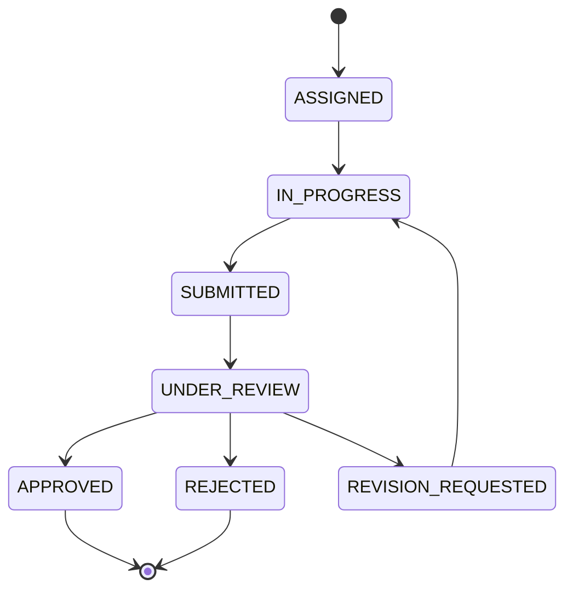
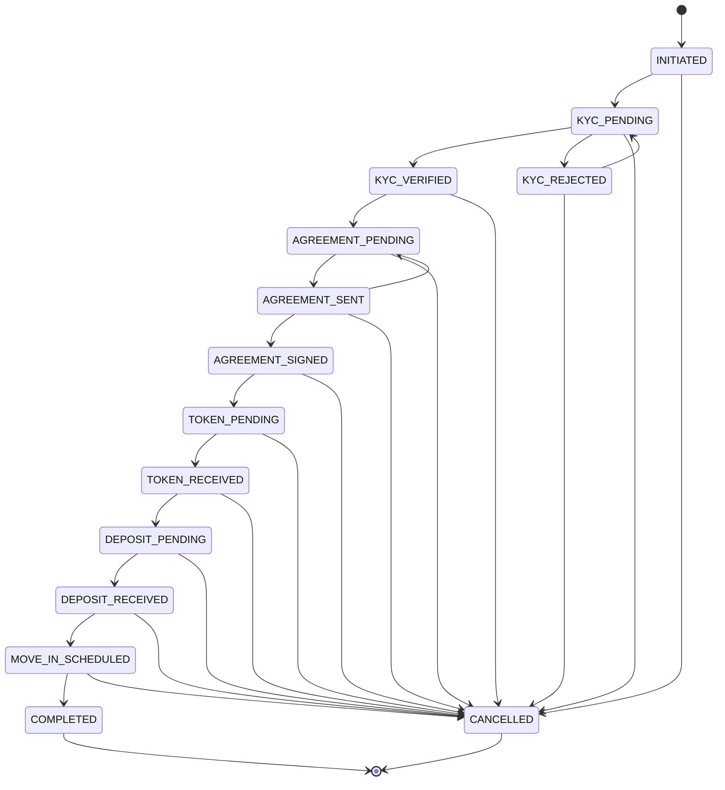
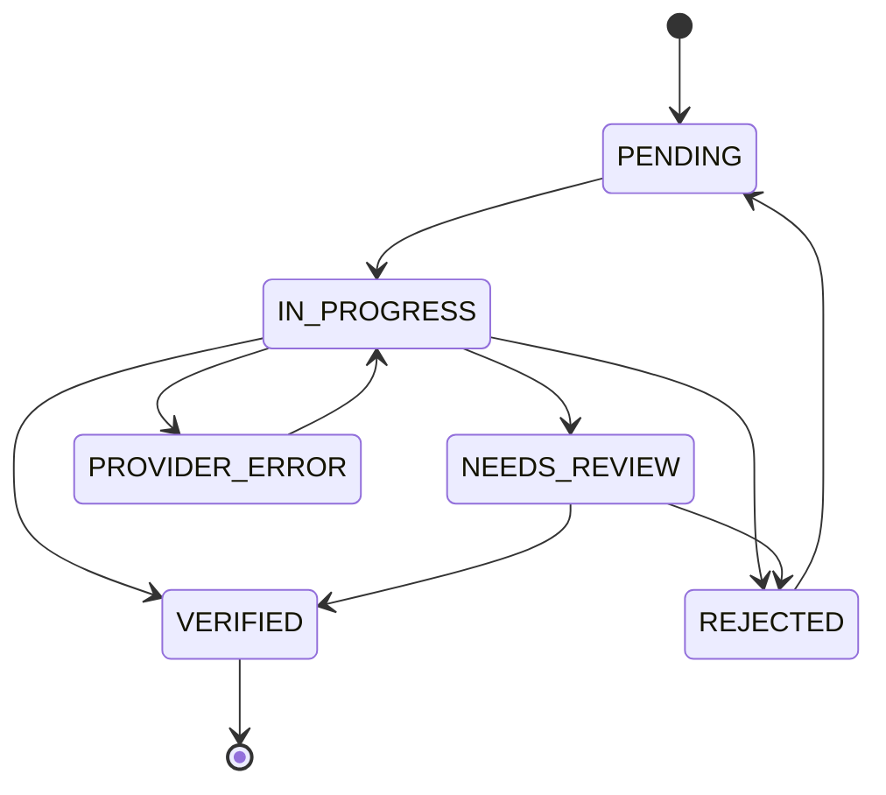
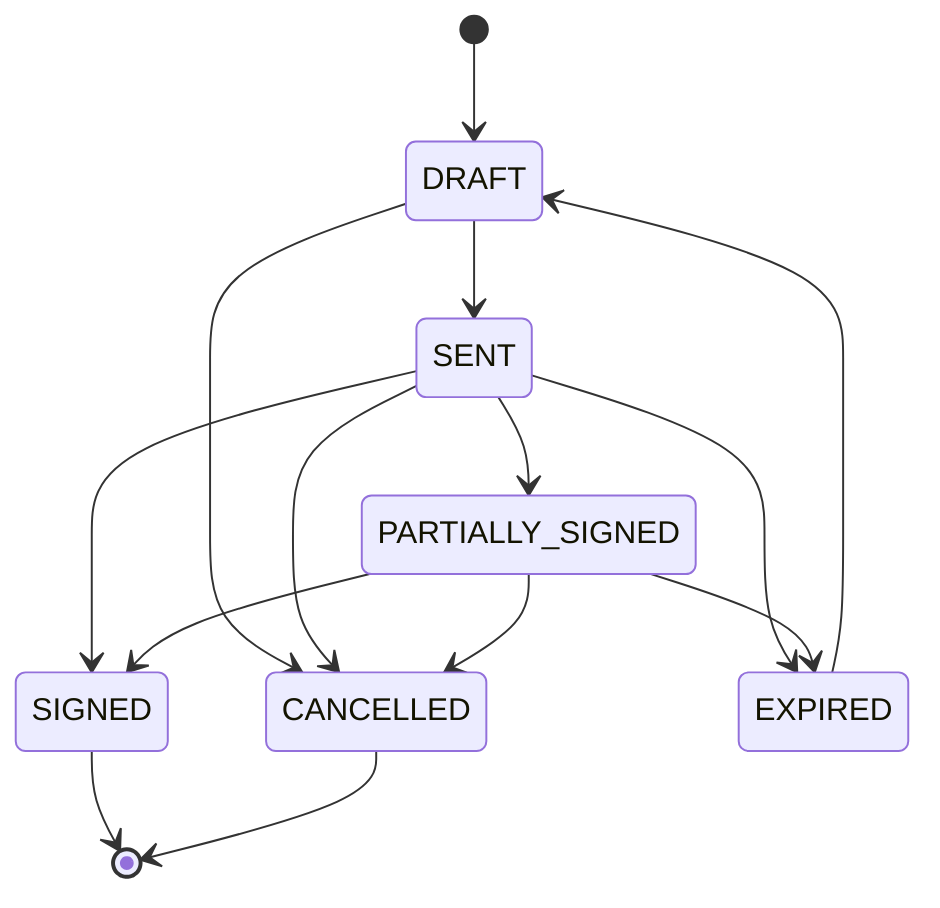
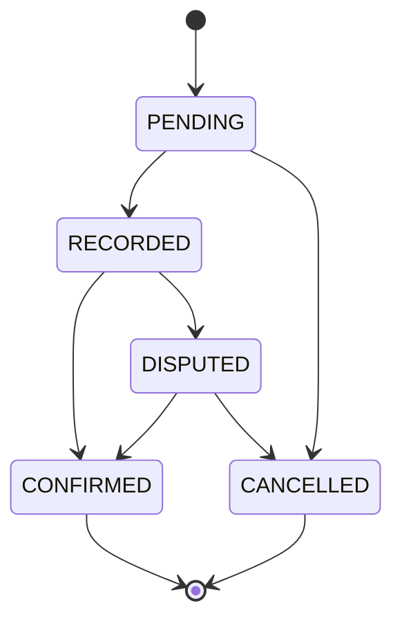
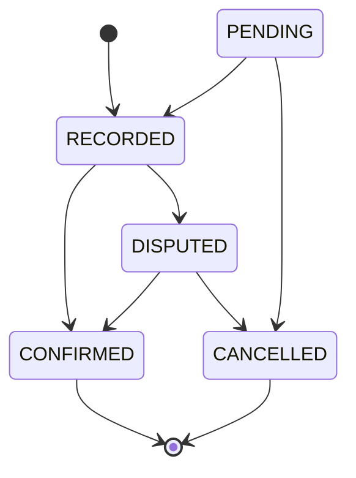
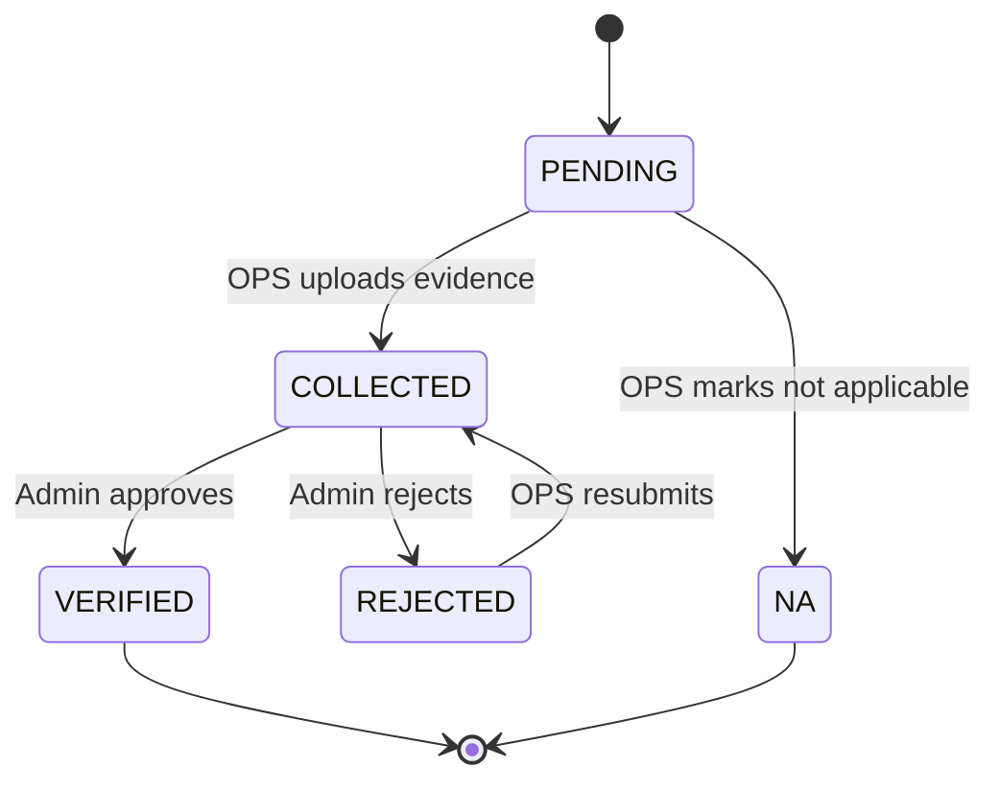
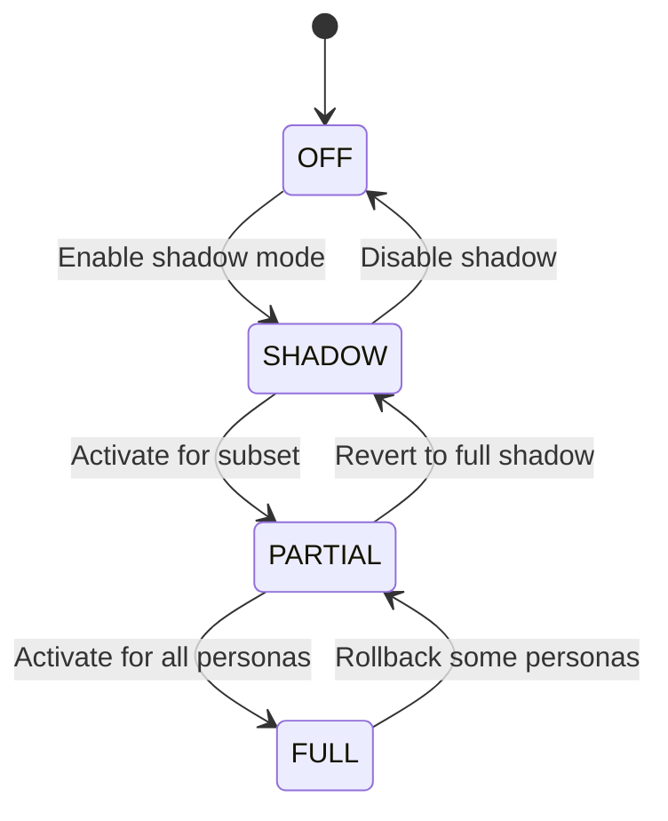

# State Machines

All status transitions for every entity with status fields. These are the source of truth for what transitions are valid. Any mutation that changes status MUST validate against these rules.

---

## Lead Status

```
                    ┌──────────────┐
                    │   SUBMITTED  │
                    └──────┬───────┘
                           │
              ┌────────────┼────────────────┐
              │            │                │
              ▼            ▼                ▼
    ┌─────────────┐  ┌──────────┐   ┌──────────────────┐
    │  NEED_INFO  │  │ REJECTED │   │ POTENTIAL_DUPLICATE│
    └──────┬──────┘  └──────────┘   └────────┬─────────┘
           │          (terminal)              │
           │                         ┌───────┼───────┐
           ▼                         │               │
     ┌──────────┐              ┌──────────┐    ┌──────────┐
     │ SUBMITTED│              │ DUPLICATE│    │ SUBMITTED│
     │ (re-enter│              └──────────┘    │(re-enter │
     │  queue)  │               (terminal)     │  queue)  │
     └──────────┘                              └──────────┘
            │
            ▼
     ┌──────────┐
     │ VERIFIED │  ← Only after owner verification with consent
     └─────┬────┘
           │ (admin rejects if circumstances change)
           ▼
     ┌──────────┐
     │ REJECTED │
     └──────────┘
```

### Transition Table

| From                  | To                    | Trigger                                                       | Who    |
| --------------------- | --------------------- | ------------------------------------------------------------- | ------ |
| (new)                 | `SUBMITTED`           | Guard submits lead                                            | Guard  |
| (new)                 | `POTENTIAL_DUPLICATE` | Guard submits + auto de-dup match                             | System |
| `SUBMITTED`           | `NEED_INFO`           | Admin requests more info                                      | Admin  |
| `SUBMITTED`           | `VERIFIED`            | Admin completes verification (outcome=VERIFIED, consent=true) | Admin  |
| `SUBMITTED`           | `REJECTED`            | Admin rejects (with reason)                                   | Admin  |
| `NEED_INFO`           | `SUBMITTED`           | Guard updates lead and resubmits                              | Guard  |
| `NEED_INFO`           | `REJECTED`            | Admin rejects (timeout or bad info)                           | Admin  |
| `POTENTIAL_DUPLICATE` | `DUPLICATE`           | Admin confirms it's a duplicate                               | Admin  |
| `POTENTIAL_DUPLICATE` | `SUBMITTED`           | Admin clears duplicate flag (not a dup)                       | Admin  |
| `VERIFIED`            | `REJECTED`            | Admin rejects verified lead (owner changes mind, new info)    | Admin  |

**Terminal states**: `REJECTED`, `DUPLICATE` — no transitions out. `VERIFIED` is **not** terminal — it can be rejected if circumstances change.

**Key rule**: Only `VERIFIED` leads can have listings, visits, or closures created.

**Duplicate verification flow**: Two-step. Admin must first clear the duplicate flag (`POTENTIAL_DUPLICATE` → `SUBMITTED`), then verify separately (`SUBMITTED` → `VERIFIED`). No direct `POTENTIAL_DUPLICATE` → `VERIFIED`.

**Lead rejection cascade**: If a lead is rejected and has a linked listing, the listing is auto-archived (`PUBLISHED` → `ARCHIVED`). Admin sees a confirmation dialog: "This lead has a published listing. Rejecting will archive it. Continue?"

---

## Society Status

```
    ┌────────────┐
    │ ONBOARDING │  ← Initial state on creation
    └─────┬──────┘
          │ (at least one building added)
          ▼
    ┌─────────┐
    │ ACTIVE  │  ← Normal operating state
    └────┬────┘
         │
         ▼
    ┌──────────┐
    │ INACTIVE │  ← Paused, guards can't submit
    └──────────┘
```

| From         | To           | Trigger                                | Who   |
| ------------ | ------------ | -------------------------------------- | ----- |
| (new)        | `ONBOARDING` | Society created                        | Admin |
| `ONBOARDING` | `ACTIVE`     | Admin activates (requires ≥1 building) | Admin |
| `ACTIVE`     | `INACTIVE`   | Admin deactivates                      | Admin |
| `INACTIVE`   | `ACTIVE`     | Admin reactivates                      | Admin |

---

## Guard Status

```
    ┌────────┐
    │ ACTIVE │ ←──────────────────────┐
    └───┬────┘                        │
        │                             │
   ┌────┼─────────┐                   │
   │              │                   │
   ▼              ▼                   │
┌──────────┐  ┌────────┐             │
│ INACTIVE │  │ BANNED │─────────────┘
└────┬─────┘  └────────┘  (admin reinstatement)
     │              ▲
     └──────────────┘
```

| From       | To         | Trigger                            | Who   |
| ---------- | ---------- | ---------------------------------- | ----- |
| (new)      | `ACTIVE`   | Guard account created              | Admin |
| `ACTIVE`   | `INACTIVE` | Admin deactivates                  | Admin |
| `ACTIVE`   | `BANNED`   | Admin bans (with mandatory reason) | Admin |
| `INACTIVE` | `ACTIVE`   | Admin reactivates                  | Admin |
| `INACTIVE` | `BANNED`   | Admin bans                         | Admin |
| `BANNED`   | `ACTIVE`   | Admin reinstates                   | Admin |
| `BANNED`   | `INACTIVE` | Admin partial reinstatement        | Admin |

**Capabilities per status**: See `features/09-quality-and-controls.md`

---

## Visit Status

```
    ┌──────────┐
    │ ASSIGNED │
    └────┬─────┘
         │
    ┌────┼──────────────────┐
    │    │                  │
    ▼    ▼                  ▼
┌───────────┐  ┌───────────┐  ┌─────────┐
│ CONFIRMED │  │ CANCELLED │  │ NO_SHOW │
└─────┬─────┘  └───────────┘  └─────────┘
      │         (terminal)      (terminal)
      │
      ▼
┌─────────────┐
│ IN_PROGRESS │
└──────┬──────┘
       │
       ▼
┌───────────┐
│ COMPLETED │
└───────────┘
  (terminal)
```

| From          | To            | Trigger                                     | Who   |
| ------------- | ------------- | ------------------------------------------- | ----- |
| (new)         | `ASSIGNED`    | Admin creates visit                         | Admin |
| `ASSIGNED`    | `CONFIRMED`   | Admin confirms (after owner confirms slot)  | Admin |
| `ASSIGNED`    | `IN_PROGRESS` | Guard starts visit (shortcut, skip confirm) | Guard |
| `ASSIGNED`    | `CANCELLED`   | Admin cancels                               | Admin |
| `ASSIGNED`    | `NO_SHOW`     | Admin marks no-show                         | Admin |
| `CONFIRMED`   | `IN_PROGRESS` | Guard starts visit                          | Guard |
| `CONFIRMED`   | `CANCELLED`   | Admin cancels                               | Admin |
| `CONFIRMED`   | `NO_SHOW`     | Admin marks no-show                         | Admin |
| `IN_PROGRESS` | `COMPLETED`   | Guard completes (with outcome)              | Guard |

**Terminal states**: `COMPLETED`, `CANCELLED`, `NO_SHOW`

**On COMPLETED**, guard must provide:

- `outcome`: `INTERESTED` / `NOT_INTERESTED` / `FOLLOWUP`
- `outcome_notes`: optional text

---

## Listing Status

```
    ┌───────┐
    │ DRAFT │  ← Created, not public yet
    └───┬───┘
        │
        ▼
    ┌───────────┐
    │ PUBLISHED │  ← Public URL active
    └─────┬─────┘
          │
          ▼
    ┌──────────┐
    │ ARCHIVED │  ← Taken down (flat rented, etc.)
    └──────────┘
```

| From        | To          | Trigger                                  | Who          |
| ----------- | ----------- | ---------------------------------------- | ------------ |
| (new)       | `DRAFT`     | Admin creates listing from verified lead | Admin        |
| `DRAFT`     | `PUBLISHED` | Admin publishes                          | Admin        |
| `PUBLISHED` | `ARCHIVED`  | Admin archives (or auto on closure)      | Admin/System |
| `PUBLISHED` | `DRAFT`     | Admin un-publishes to edit               | Admin        |
| `ARCHIVED`  | `DRAFT`     | Admin wants to re-list                   | Admin        |

---

## Closure Status

```
    ┌─────────┐
    │ PENDING │  ← Deal recorded, docs being collected
    └────┬────┘
         │
    ┌────┼────────┐
    │             │
    ▼             ▼
┌───────────┐  ┌───────────┐
│ CONFIRMED │  │ CANCELLED │
└───────────┘  └───────────┘
```

| From      | To          | Trigger                                     | Who   |
| --------- | ----------- | ------------------------------------------- | ----- |
| (new)     | `PENDING`   | Admin creates closure                       | Admin |
| `PENDING` | `CONFIRMED` | Admin confirms (docs complete)              | Admin |
| `PENDING` | `CANCELLED` | Deal falls through (tenant backs out, etc.) | Admin |

**Terminal states**: `CONFIRMED`, `CANCELLED`

**Key rule**: Payout can only be created after closure is `CONFIRMED`. If closure is cancelled, any linked payout in `pending` state is voided.

**Negotiation gate**: When a closure is linked to a negotiation (via `negotiation_id`), it CANNOT move to `CONFIRMED` until ALL of the following are true on the linked negotiation:

> ⚠️ `negotiation_id` is a P26 (Rent Negotiation) field and is not implemented in P34 transaction rails. P34 transactions use `tenant_inquiry_id` for provenance instead. `source_negotiation_id` is reserved as an optional placeholder.

1. Negotiation `status` is `READY_FOR_CLOSURE`
2. An accepted `negotiation_proposal` exists with both `tenant_sign_off_at` and `owner_sign_off_at` set
3. Token payment is recorded (`token_status` is `COLLECTED`)
4. Brokerage terms are recorded on the accepted proposal
5. Police verification status is tracked (`police_verification_status` is not `NOT_STARTED`)
6. Society NOC status is tracked (`society_noc_status` is not `NOT_STARTED`)
7. Rent agreement is uploaded (`rent_agreement_storage_id` is set on the negotiation)

See [Rent Negotiation](features/19-rent-negotiation.md) and [Closure & Payouts](features/07-closure-and-payouts.md) for the full gate specification.

---

## Payout Status

```
    ┌─────────┐
    │ pending │  ← Payout record created
    └────┬────┘
         │
    ┌────┼────────┐
    │             │
    ▼             ▼
┌──────────┐  ┌────────┐
│ approved │  │ voided │  ← Closure cancelled / admin void
└────┬─────┘  └────────┘
     │          (terminal)
  ┌──┴──┐
  │     │
  ▼     ▼
┌────────────┐  ┌────────┐
│ disbursed  │  │ failed │  ← Disbursement failed
└────────────┘  └────────┘
  (terminal)    (terminal)
```

| From       | To          | Trigger                                          | Who                                |
| ---------- | ----------- | ------------------------------------------------ | ---------------------------------- |
| (new)      | `pending`   | Admin creates payout (closure must be CONFIRMED) | Admin                              |
| `pending`  | `approved`  | Admin approves                                   | Admin (with `payouts.approve`)     |
| `pending`  | `voided`    | Linked closure cancelled or admin manual void    | System/Admin (with `payouts.void`) |
| `approved` | `disbursed` | Admin marks disbursed (money transferred)        | Admin (with `payouts.disburse`)    |
| `approved` | `failed`    | Disbursement attempt failed                      | Admin (with `payouts.disburse`)    |
| `approved` | `voided`    | Admin voids before disbursement                  | Admin (with `payouts.void`)        |

**Terminal states**: `disbursed`, `failed`, `voided`

**Separation of duties** (recommended, not system-enforced in V1):

- Different admin creates vs approves vs disburses

---

## Incentive Card States

| Field            | Values            | Description                      |
| ---------------- | ----------------- | -------------------------------- |
| `awarded_method` | `AUTO` / `MANUAL` | How it was created               |
| `is_active`      | `true` / `false`  | Whether card is currently active |

- AUTO cards start `is_active: false` (pending admin confirmation)
- MANUAL cards start `is_active: true` (immediately active)
- Admin can revoke any card (`is_active: true` → `false`)
- Admin can confirm auto-suggestions (`is_active: false` → `true`)

---

## Tenant Inquiry Status

```
     ┌───────────┐
     │ SUBMITTED │  ← Tenant submits visit request on listing
     └─────┬─────┘
           │
      ┌────┼────────┐
      │             │
      ▼             ▼
┌──────────┐   ┌──────────┐
│ REVIEWED │   │ REJECTED │
└────┬─────┘   └──────────┘
     │          (terminal)
     ▼
┌──────────────┐
│ BOUNTY_POSTED│  ← Ops posts as bounty for guards
└──────┬───────┘
       │
  ┌────┼────────┐
  │             │
  ▼             ▼
┌────────────────┐  ┌─────────┐
│ GUARD_ACCEPTED │  │ EXPIRED │  ← No guard accepts in X days
└───────┬────────┘  └─────────┘
        │             (terminal)
        ▼
┌─────────────────┐
│ VISIT_SCHEDULED │
└───────┬─────────┘
        │
        ▼
┌─────────────────┐
│ VISIT_COMPLETED │
└───────┬─────────┘
        │
   ┌────┼──────────────────────────┐
   │                               │
   ▼                               ▼
┌────────┐          ┌──────────────────────┐
│ CLOSED │          │ NEGOTIATION_INITIATED │  ← Ops opens negotiation
└────────┘          │  (visit = INTERESTED) │      after INTERESTED outcome
 (terminal)         └──────────┬───────────┘
                               │ (negotiation reaches READY_FOR_CLOSURE)
                               ▼
                          ┌────────┐
                          │ CLOSED │
                          └────────┘
                           (terminal)
```

### Transition Table

| From                    | To                      | Trigger                                                         | Who    |
| ----------------------- | ----------------------- | --------------------------------------------------------------- | ------ |
| (new)                   | `SUBMITTED`             | Tenant submits visit request                                    | Tenant |
| `SUBMITTED`             | `REVIEWED`              | Ops reviews the inquiry                                         | Admin  |
| `SUBMITTED`             | `REJECTED`              | Ops rejects (spam, invalid, etc.)                               | Admin  |
| `REVIEWED`              | `BOUNTY_POSTED`         | Ops posts as bounty for guards                                  | Admin  |
| `REVIEWED`              | `REJECTED`              | Ops rejects after review                                        | Admin  |
| `BOUNTY_POSTED`         | `GUARD_ACCEPTED`        | Guard claims the bounty                                         | Guard  |
| `BOUNTY_POSTED`         | `EXPIRED`               | No guard accepts within expiry window                           | System |
| `GUARD_ACCEPTED`        | `VISIT_SCHEDULED`       | Ops confirms visit schedule                                     | Admin  |
| `VISIT_SCHEDULED`       | `VISIT_COMPLETED`       | Guard completes the showing                                     | Guard  |
| `VISIT_COMPLETED`       | `NEGOTIATION_INITIATED` | Ops opens negotiation (visit outcome was `INTERESTED`)          | Admin  |
| `VISIT_COMPLETED`       | `CLOSED`                | Ops closes without negotiation (`NOT_INTERESTED` or `FOLLOWUP`) | Admin  |
| `NEGOTIATION_INITIATED` | `CLOSED`                | Negotiation reaches `READY_FOR_CLOSURE` and closure confirmed   | Admin  |

**Terminal states**: `REJECTED`, `EXPIRED`, `CLOSED`

**Key rules**:

- Tenant visit requests do NOT auto-schedule. Ops has full control.
- Bounty expires if no guard accepts within a configurable window (stored in `system_config`).
- The assigned guard does the physical showing — same guard visit execution flow as existing visits.
- `NEGOTIATION_INITIATED` is only valid when the linked visit outcome was `INTERESTED`. For `NOT_INTERESTED` or `FOLLOWUP`, ops closes directly.
- A tenant can have multiple active negotiations across different listings simultaneously.
- See [Rent Negotiation](features/19-rent-negotiation.md) for the full negotiation workflow.

---

## Owner Service Request Status

```
     ┌───────────┐
     │ SUBMITTED │  ← Owner submits contact form
     └─────┬─────┘
           │
      ┌────┼────────┐
      │             │
      ▼             ▼
┌───────────┐   ┌──────────┐
│ CONTACTED │   │ REJECTED │
└─────┬─────┘   └──────────┘
      │           (terminal)
 ┌────┼────────┐
 │             │
 ▼             ▼
┌────────────┐  ┌─────────┐
│ ONBOARDED  │  │ DROPPED │
└─────┬──────┘  └─────────┘
      │           (terminal)
      ▼
┌─────────┐
│ ACTIVE  │
└─────────┘
```

### Transition Table

| From        | To          | Trigger                                    | Who                                                            |
| ----------- | ----------- | ------------------------------------------ | -------------------------------------------------------------- |
| (new)       | `SUBMITTED` | Owner submits contact form                 | Owner (public)                                                 |
| `SUBMITTED` | `CONTACTED` | Ops reaches out to owner                   | Admin or OPS (with `owner_service_requests.manage` permission) |
| `SUBMITTED` | `REJECTED`  | Ops rejects (spam, out of area, etc.)      | Admin or OPS (with `owner_service_requests.manage` permission) |
| `CONTACTED` | `ONBOARDED` | Owner agrees, ops creates their account    | Admin or OPS (with `owner_service_requests.manage` permission) |
| `CONTACTED` | `DROPPED`   | Owner not interested / unreachable         | Admin or OPS (with `owner_service_requests.manage` permission) |
| `ONBOARDED` | `ACTIVE`    | Owner's property is being actively managed | Admin or OPS (with `owner_service_requests.manage` permission) |

**Terminal states**: `REJECTED`, `DROPPED`

---

## Owner Lifecycle Status

```
     ┌──────────┐
     │ PROSPECT │  ← Owner captured from lead/request
     └────┬─────┘
          │
          ▼
     ┌──────────┐
     │ VERIFIED │  ← At least one linked lead verified
     └────┬─────┘
          │
          ▼
     ┌────────┐
     │ ACTIVE │  ← Owner has active listing/deal activity
     └────┬───┘
          │
          ▼
     ┌─────────┐
     │ MANAGED │  ← Owner under ongoing RM management
     └────┬────┘
          │
          ▼
     ┌─────────┐
     │ DORMANT │  ← No recent activity; can reactivate
     └────┬────┘
          │
     ┌────┴─────────────────┐
     │                      │
     ▼                      ▼
┌──────────┐           ┌─────────┐
│ CHURNED  │           │ ACTIVE  │  (reactivation on new activity)
└──────────┘           └─────────┘
(terminal)
```

### Transition Table

| From       | To         | Trigger                                             | Who    |
| ---------- | ---------- | --------------------------------------------------- | ------ |
| (new)      | `PROSPECT` | Owner captured from lead or service request         | System |
| `PROSPECT` | `VERIFIED` | At least one linked lead transitions to VERIFIED    | System |
| `VERIFIED` | `ACTIVE`   | Owner has active listing or deal activity           | Admin  |
| `ACTIVE`   | `MANAGED`  | Admin assigns RM or system auto-assigns             | Admin  |
| `MANAGED`  | `DORMANT`  | No activity for configurable period (e.g., 90 days) | System |
| `DORMANT`  | `ACTIVE`   | New lead activity or admin reactivation             | System |
| `PROSPECT` | `CHURNED`  | Admin explicitly marks churned                      | Admin  |
| `VERIFIED` | `CHURNED`  | Admin explicitly marks churned                      | Admin  |
| `ACTIVE`   | `CHURNED`  | Admin explicitly marks churned                      | Admin  |
| `MANAGED`  | `CHURNED`  | Admin explicitly marks churned                      | Admin  |
| `DORMANT`  | `CHURNED`  | Admin explicitly marks churned                      | Admin  |

**Terminal states**: `CHURNED`

**Key rules**:

- Owner lifecycle is auto-managed by system events (lead verification, activity detection).
- Dormant owners reactivate automatically on new lead activity.
- Admin can manually transition to CHURNED from `PROSPECT`, `VERIFIED`, `ACTIVE`, `MANAGED`, or `DORMANT`.

---

## Support Inquiry Status

```
     ┌──────┐
     │ OPEN │ ←──────────┐
     └──┬───┘            │
        │ (admin assigns) │ (admin reopens)
        ▼                │
     ┌────────────┐      │
     │ IN_PROGRESS│      │
     └──┬─────────┘      │
        │                │
        ▼                │
     ┌──────────┐        │
     │ RESOLVED │        │
     └──┬───────┘        │
        │                │
        ▼                │
     ┌──────┐            │
     │ CLOSED│───────────┘
     └───────┘
```

### Transition Table

| From          | To            | Trigger                                    | Who                                                       |
| ------------- | ------------- | ------------------------------------------ | --------------------------------------------------------- |
| (new)         | `OPEN`        | Support inquiry submitted via contact form | User                                                      |
| `OPEN`        | `IN_PROGRESS` | Admin assigns to self or another admin     | Admin or OPS (with `support_inquiries.manage` permission) |
| `IN_PROGRESS` | `RESOLVED`    | Admin marks issue resolved                 | Admin or OPS (with `support_inquiries.manage` permission) |
| `RESOLVED`    | `CLOSED`      | Admin closes inquiry                       | Admin or OPS (with `support_inquiries.manage` permission) |
| `OPEN`        | `CLOSED`      | Admin closes without resolution (spam)     | Admin or OPS (with `support_inquiries.manage` permission) |

**Terminal states**: `CLOSED`

**Key rules**:

- Support inquiries are forward-only (no backtracking).
- Admin can close from OPEN (spam) or RESOLVED (normal closure).
- Inquiries can be reassigned between admins while in OPEN or IN_PROGRESS.

---

## Referral Status

```
    ┌─────────┐
    │ PENDING │  ← Referral recorded (sign-up or guard creation)
    └────┬────┘
         │ (milestone event occurs)
         ▼
    ┌───────────┐
    │ QUALIFIED │  ← At least one milestone triggered
    └─────┬─────┘
          │
     ┌────┼───────────┐
     │                │
     ▼                ▼
┌────────────────┐  ┌───────────┐
│ PARTIALLY_PAID │  │ FULLY_PAID│
└───────┬────────┘  └───────────┘
        │             (terminal)
        ▼
  ┌───────────┐
  │ FULLY_PAID│
  └───────────┘

Any state → VOIDED (admin voids referral)
```

### Transition Table

| From             | To               | Trigger                                                                     | Who    |
| ---------------- | ---------------- | --------------------------------------------------------------------------- | ------ |
| (new)            | `PENDING`        | Referral recorded (sign-up via code, or guard creation with referrer phone) | System |
| `PENDING`        | `QUALIFIED`      | First milestone triggered (e.g., SIGN_UP milestone)                         | System |
| `PENDING`        | `VOIDED`         | Admin voids (invalid referral, wrong attribution)                           | Admin  |
| `QUALIFIED`      | `PARTIALLY_PAID` | At least one milestone paid, others still pending                           | Admin  |
| `QUALIFIED`      | `FULLY_PAID`     | All milestones paid in one go                                               | Admin  |
| `QUALIFIED`      | `VOIDED`         | Admin voids                                                                 | Admin  |
| `PARTIALLY_PAID` | `FULLY_PAID`     | Final milestone paid                                                        | Admin  |
| `PARTIALLY_PAID` | `VOIDED`         | Admin voids remaining milestones                                            | Admin  |

**Terminal states**: `FULLY_PAID`, `VOIDED`

**Key rules**:

- DemoRentals referrals are created with a `SIGN_UP` milestone in `TRIGGERED`, so they typically move `PENDING` → `QUALIFIED` immediately in the same flow.
- Deal linkage fields (`listing_id`, `closure_id`) are only auto-patched while the corresponding milestone is still `PENDING`; once triggered/approved/paid, linkage is treated as immutable.

### Referral Milestone Status

| From        | To          | Trigger                                                                               | Who          |
| ----------- | ----------- | ------------------------------------------------------------------------------------- | ------------ |
| `PENDING`   | `TRIGGERED` | Milestone event occurs (sign-up, listing published, deal closed, first verified lead) | System       |
| `PENDING`   | `VOIDED`    | Parent referral voided                                                                | System/Admin |
| `TRIGGERED` | `APPROVED`  | Admin approves milestone payout                                                       | Admin        |
| `TRIGGERED` | `VOIDED`    | Admin voids (deal cancelled, invalid)                                                 | Admin        |
| `APPROVED`  | `PAID`      | Admin marks money disbursed                                                           | Admin        |
| `APPROVED`  | `VOIDED`    | Admin voids before payment                                                            | Admin        |

**Terminal states**: `PAID`, `VOIDED`

**Trigger semantics**:

- Trigger mutations are idempotent by `source_event` (`by_referral_and_source_event` index), so replayed events are ignored.
- `LISTING_PUBLISHED` events are sourced from listing publish plus tenant-inquiry backfill paths; `DEAL_CLOSED` events are sourced from closure confirmation.
- Tenant closure attribution resolves through `closure.visit_id` → `visits.tenant_inquiry_id` → `tenant_inquiries.tenant_id` before triggering tenant milestones.

---

## Chat Channel Status

```
    ┌────────┐
    │ ACTIVE │  ← Initial state on create
    └───┬────┘
        │
        ▼
   ┌──────────┐
   │ ARCHIVED │
   └────┬─────┘
        │
        └──────────────→ ACTIVE (admin reopen)
```

| From       | To         | Trigger                                      | Who   |
| ---------- | ---------- | -------------------------------------------- | ----- |
| (new)      | `ACTIVE`   | Admin opens chat channel on a tenant inquiry | Admin |
| `ACTIVE`   | `ARCHIVED` | Admin archives channel                       | Admin |
| `ARCHIVED` | `ACTIVE`   | Admin reopens archived channel               | Admin |

**Terminal states**: none

**Validation helper**: `lib/chat.ts` — `validateChannelTransition(current, next)`.

**P25 Update**: `ARCHIVED` channels can be reopened by admin, enabling deal room reactivation.

---

## Chat Message Status

Individual messages move from intake to delivery/failure with explicit processing states:

```
    ┌───────────┐
    │ SUBMITTED │  ← User hit send
    └─────┬─────┘
          │ (batch window closes, message added to batch)
          ▼
      ┌─────────┐
      │ BATCHED │
      └────┬────┘
           │
           ▼
    ┌────────────┐
    │ PROCESSING │
    └─────┬──────┘
          │
     ┌────┼────────┐
     │             │
     ▼             ▼
     ┌───────────┐  ┌────────┐
     │ DELIVERED │  │ FAILED │
     └───────────┘  └────┬───┘
                         │
                         └──────────────→ DELIVERED (admin approval)
```

| From         | To           | Trigger                                     | Who    |
| ------------ | ------------ | ------------------------------------------- | ------ |
| (new)        | `SUBMITTED`  | Tenant/owner/ops sends message              | User   |
| `SUBMITTED`  | `BATCHED`    | Batch window closes, message added to batch | System |
| `BATCHED`    | `PROCESSING` | AI masking pipeline starts                  | System |
| `PROCESSING` | `DELIVERED`  | Masked message finalized                    | System |
| `PROCESSING` | `FAILED`     | Masking pipeline fails                      | System |
| `FAILED`     | `DELIVERED`  | Admin approves failed message for delivery  | Admin  |

**Terminal states**: `DELIVERED`

**Validation helper**: `lib/chat.ts` — `validateMessageTransition(current, next)`.

---

## Chat Message Batch Status

Batches are the processing unit that groups messages for AI masking:

```
    ┌────────────┐
    │ COLLECTING │  ← Batch window open, messages being added
    └─────┬──────┘
          │ (batch window closes)
          ▼
    ┌────────────┐
    │ PROCESSING │  ← AI rewrite in progress
    └─────┬──────┘
          │
     ┌────┼────────┐
     │             │
     ▼             ▼
     ┌───────────┐  ┌────────┐
     │ DELIVERED │  │ FAILED │
     └───────────┘  └────┬───┘
                         │
                         └──────────────→ DELIVERED (admin reconciliation)
```

| From         | To           | Trigger                                | Who    |
| ------------ | ------------ | -------------------------------------- | ------ |
| (new)        | `COLLECTING` | First message in batch window          | System |
| `COLLECTING` | `PROCESSING` | Batch window closes, AI rewrite starts | System |
| `PROCESSING` | `DELIVERED`  | AI rewrite complete                    | System |
| `PROCESSING` | `FAILED`     | AI API error after max retries         | System |
| `FAILED`     | `DELIVERED`  | Admin reconciliation delivers batch    | Admin  |

**Terminal states**: `DELIVERED`

**Validation helper**: `lib/chat.ts` — `validateBatchTransition(current, next)`.

---

## Deal Checklist Status

```
    ┌───────┐
    │ DRAFT │
    └───┬───┘
        │ (admin share)
        ▼
    ┌────────┐
    │ SHARED │
    └───┬────┘
        │ (first party response)
   ┌────┴──────────────┐
   ▼                   ▼
┌───────────┐      ┌──────────┐
│ IN_REVIEW │      │ DISPUTED │
└─────┬─────┘      └────┬─────┘
      │                 │
      │                 ▼
      │            ┌───────────┐
      │            │ IN_REVIEW │
      │            └─────┬─────┘
      │                  │
      ▼                  │
┌──────────┐             │
│ APPROVED │             │
└──────────┘             │

Any non-terminal state can be superseded to `SUPERSEDED` when admin regenerates a new version.
```

| From        | To           | Trigger                                                                | Who          |
| ----------- | ------------ | ---------------------------------------------------------------------- | ------------ |
| (new)       | `DRAFT`      | Checklist created (manual or AI generation)                            | Admin/System |
| `DRAFT`     | `SHARED`     | Checklist shared to parties                                            | Admin/OPS    |
| `SHARED`    | `IN_REVIEW`  | First response submitted and no disputed items after recompute         | Tenant/Owner |
| `SHARED`    | `DISPUTED`   | First response creates at least one disputed item                      | Tenant/Owner |
| `IN_REVIEW` | `DISPUTED`   | Any item becomes disputed                                              | Tenant/Owner |
| `IN_REVIEW` | `DRAFT`      | Admin reverts to draft for re-editing                                  | Admin/OPS    |
| `DISPUTED`  | `IN_REVIEW`  | Admin resolves all disputed items (resets approvals for resolved item) | Admin/OPS    |
| `DISPUTED`  | `DRAFT`      | Admin reverts disputed checklist to draft                              | Admin/OPS    |
| `IN_REVIEW` | `APPROVED`   | Both signatures present and all items are mutually agreed              | Tenant+Owner |
| `DRAFT`     | `SUPERSEDED` | Regenerate checklist version                                           | Admin/OPS    |
| `SHARED`    | `SUPERSEDED` | Regenerate checklist version                                           | Admin/OPS    |
| `IN_REVIEW` | `SUPERSEDED` | Regenerate checklist version                                           | Admin/OPS    |
| `DISPUTED`  | `SUPERSEDED` | Regenerate checklist version                                           | Admin/OPS    |

**Terminal states**: `APPROVED`, `SUPERSEDED`

### Deal Checklist Item Approval Status (per party)

| From      | To                               | Trigger                              | Who          |
| --------- | -------------------------------- | ------------------------------------ | ------------ |
| `PENDING` | `AGREED`/`DISAGREED`/`COMMENTED` | Party submits first response on item | Tenant/Owner |

**Key rule**: item approval is write-once per party for a version; only admin dispute resolution/regeneration resets approvals to `PENDING`.

### Deal Checklist Item Overall Status (derived)

| Inputs                                   | Derived `overall_status` |
| ---------------------------------------- | ------------------------ |
| tenant=`AGREED` and owner=`AGREED`       | `RESOLVED`               |
| either side=`DISAGREED`                  | `DISPUTED`               |
| either side=`COMMENTED` (none DISAGREED) | `NEEDS_DISCUSSION`       |
| all other combinations                   | `UNREVIEWED`             |

### Owner Invite Status

| From      | To            | Trigger                                    | Who                 |
| --------- | ------------- | ------------------------------------------ | ------------------- |
| (new)     | `PENDING`     | Invite generated                           | Admin/OPS           |
| `PENDING` | `CONSUMED`    | Valid token consumed by authenticated user | Owner/Tenant->Owner |
| `PENDING` | `EXPIRED`     | Expiry reached (query/cron/admin flow)     | System              |
| `PENDING` | `REGENERATED` | Admin regenerates invite                   | Admin/OPS           |
| `EXPIRED` | `REGENERATED` | Admin regenerates invite                   | Admin/OPS           |

**Regeneration flow**: When an invite is regenerated, the existing invite (whether `PENDING` or `EXPIRED`) is marked `REGENERATED`, and a **new** invite record is created in `PENDING` status with a fresh token and expiry window.

### Deal Checklist Signature Lifecycle (derived)

There is no explicit signature status enum. Effective lifecycle is inferred from records in `deal_checklist_signatures`:

- `UNSIGNED`: no signature rows for checklist
- `PARTIALLY_SIGNED`: one of tenant/owner has signed
- `FULLY_SIGNED`: both tenant and owner have signed (checklist auto-patches to `APPROVED`)

Admin dispute resolution deletes existing signatures for the checklist, returning lifecycle to `UNSIGNED`.

---

## Phase 26: Negotiation Status

Tracks the lifecycle of a rent negotiation between tenant and owner, mediated by DemoRentals ops.

```
                    ┌───────────┐
                    │ INITIATED │
                    └─────┬─────┘
                          │
                          ▼
                    ┌────────┐
                    │ ACTIVE │
                    └────┬───┘
                         │
                         ▼
                 ┌────────────────┐
                 │ TERMS_PROPOSED │
                 └───────┬────────┘
                         │
                  ┌──────┴────────────┐
                  ▼                   ▼
        ┌──────────────────┐  ┌──────────────┐
        │ COUNTER_PROPOSED │  │ TERMS_AGREED │
        └────────┬─────────┘  └──────┬───────┘
                 │                   │
                 └────────┬──────────┘
                          ▼
                 ┌─────────────────┐
                 │ TOKEN_COLLECTED │
                 └────────┬────────┘
                          │
                          ▼
            ┌─────────────────────────────┐
            │ DOCUMENTATION_IN_PROGRESS   │
            └──────────────┬──────────────┘
                           │
                           ▼
            ┌─────────────────────────────┐
            │ READY_FOR_CLOSURE           │
            └─────────────────────────────┘

Parallel path: STALLED → ACTIVE (resume) or FAILED.
Failure paths: allowed per table below.
Expiry path: ACTIVE / TERMS_PROPOSED → EXPIRED.
```

### Negotiation Transition Table

| From                        | To                          | Trigger                                      | Who    |
| --------------------------- | --------------------------- | -------------------------------------------- | ------ |
| (new)                       | `INITIATED`                 | Ops starts negotiation from eligible inquiry | Admin  |
| `INITIATED`                 | `ACTIVE`                    | Ops activates negotiation rooms              | Admin  |
| `INITIATED`                 | `FAILED`                    | Negotiation abandoned immediately            | Admin  |
| `ACTIVE`                    | `TERMS_PROPOSED`            | Ops shares a structured proposal             | Admin  |
| `ACTIVE`                    | `FAILED`                    | Negotiation breaks down                      | Admin  |
| `ACTIVE`                    | `EXPIRED`                   | No activity within configured stale window   | System |
| `TERMS_PROPOSED`            | `COUNTER_PROPOSED`          | Counter requested from either side           | Admin  |
| `TERMS_PROPOSED`            | `TERMS_AGREED`              | Both parties agree to a proposal             | Admin  |
| `TERMS_PROPOSED`            | `FAILED`                    | Negotiation breaks down                      | Admin  |
| `TERMS_PROPOSED`            | `EXPIRED`                   | No activity within configured stale window   | System |
| `COUNTER_PROPOSED`          | `TERMS_PROPOSED`            | Ops issues revised proposal (cyclic loop)    | Admin  |
| `COUNTER_PROPOSED`          | `FAILED`                    | Negotiation breaks down                      | Admin  |
| `TERMS_AGREED`              | `TOKEN_COLLECTED`           | Token advance recorded                       | Admin  |
| `TERMS_AGREED`              | `TERMS_PROPOSED`            | Agreement withdrawn; proposal reopened       | Admin  |
| `TERMS_AGREED`              | `FAILED`                    | Negotiation breaks down                      | Admin  |
| `TOKEN_COLLECTED`           | `DOCUMENTATION_IN_PROGRESS` | Post-agreement documentation workflow starts | Admin  |
| `TOKEN_COLLECTED`           | `FAILED`                    | Negotiation breaks down                      | Admin  |
| `DOCUMENTATION_IN_PROGRESS` | `READY_FOR_CLOSURE`         | Mandatory checklist items are complete       | Admin  |
| `DOCUMENTATION_IN_PROGRESS` | `FAILED`                    | Negotiation breaks down                      | Admin  |
| `STALLED`                   | `ACTIVE`                    | Ops resumes the stalled negotiation          | Admin  |
| `STALLED`                   | `FAILED`                    | Ops marks stalled negotiation as failed      | Admin  |

**Terminal states**: `READY_FOR_CLOSURE`, `CLOSED`, `FAILED`, `EXPIRED`.

**Key rules**:

- `TERMS_PROPOSED ↔ COUNTER_PROPOSED` is an intentional negotiation cycle.
- `READY_FOR_CLOSURE` is the handoff gate to closure lifecycle.
- `STALLED` is an escalation marker state; it can only resume to `ACTIVE` or end in `FAILED`.

---

## Terms Proposal Status

Each proposal version in a negotiation has a compact lifecycle:

| Value         | Description                                |
| ------------- | ------------------------------------------ |
| `DRAFT`       | Proposal is being prepared by ops          |
| `SHARED`      | Proposal has been shared for party consent |
| `BOTH_AGREED` | Tenant and owner have both signed          |
| `SUPERSEDED`  | Newer proposal version replaced this one   |

### Terms Proposal Transition Table

| From     | To            | Trigger                                    | Who   |
| -------- | ------------- | ------------------------------------------ | ----- |
| (new)    | `DRAFT`       | Ops creates proposal version               | Admin |
| `DRAFT`  | `SHARED`      | Ops shares proposal                        | Admin |
| `DRAFT`  | `SUPERSEDED`  | Draft abandoned in favor of newer version  | Admin |
| `SHARED` | `BOTH_AGREED` | Both parties sign proposal                 | Admin |
| `SHARED` | `SUPERSEDED`  | New proposal version replaces shared terms | Admin |

**Terminal states**: `BOTH_AGREED`, `SUPERSEDED`.

**Key rule**: Once a proposal reaches `BOTH_AGREED`, it is immutable and becomes the negotiation source of truth.

---

## Token Status

Tracks the token advance (earnest money) collected by DemoRentals as part of the negotiation.

| Value       | Description                                              |
| ----------- | -------------------------------------------------------- |
| `PENDING`   | Token amount agreed but not yet collected                |
| `COLLECTED` | DemoRentals received the token (cash, UPI, or bank transfer) |
| `REFUNDED`  | Token returned to tenant                                 |
| `FORFEITED` | Tenant backed out; token kept per refund policy          |
| `DISPUTED`  | Refund dispute in progress                               |

### Token Transition Table

| From        | To          | Trigger                                         | Who   |
| ----------- | ----------- | ----------------------------------------------- | ----- |
| (new)       | `PENDING`   | Token amount agreed in proposal                 | Admin |
| `PENDING`   | `COLLECTED` | DemoRentals records receipt of token payment        | Admin |
| `COLLECTED` | `REFUNDED`  | Deal falls through, refund policy allows return | Admin |
| `COLLECTED` | `FORFEITED` | Tenant backed out, policy dictates forfeiture   | Admin |
| `COLLECTED` | `DISPUTED`  | Tenant disputes refund decision                 | Admin |
| `DISPUTED`  | `REFUNDED`  | Dispute resolved in tenant's favour             | Admin |
| `DISPUTED`  | `FORFEITED` | Dispute resolved in owner's favour              | Admin |

**Terminal states**: `REFUNDED`, `FORFEITED`

**Key rule**: `COLLECTED` is required before negotiation can advance to `DOCUMENTATION_IN_PROGRESS`.

---

## Validation Pattern

Every status-changing mutation should validate transitions:

```typescript
function validateTransition(entity: string, currentStatus: string, newStatus: string): boolean {
  const validTransitions: Record<string, Record<string, string[]>> = {
    lead: {
      SUBMITTED: ["NEED_INFO", "VERIFIED", "REJECTED"],
      NEED_INFO: ["SUBMITTED", "REJECTED"],
      POTENTIAL_DUPLICATE: ["DUPLICATE", "SUBMITTED"], // NO direct → VERIFIED (two-step: clear flag first)
      VERIFIED: ["REJECTED"],
      // REJECTED, DUPLICATE: terminal (no outgoing transitions)
    },
    visit: {
      ASSIGNED: ["CONFIRMED", "IN_PROGRESS", "CANCELLED", "NO_SHOW"],
      CONFIRMED: ["IN_PROGRESS", "CANCELLED", "NO_SHOW"],
      IN_PROGRESS: ["COMPLETED"],
      // COMPLETED, CANCELLED, NO_SHOW: terminal
    },
    closure: {
      PENDING: ["CONFIRMED", "CANCELLED"],
      // CONFIRMED, CANCELLED: terminal
    },
    payout: {
      pending: ["approved", "voided"],
      approved: ["disbursed", "failed", "voided"],
      // disbursed, failed, voided: terminal
    },
    tenant_inquiry: {
      SUBMITTED: ["REVIEWED", "REJECTED"],
      REVIEWED: ["BOUNTY_POSTED", "REJECTED"],
      BOUNTY_POSTED: ["GUARD_ACCEPTED", "EXPIRED"],
      GUARD_ACCEPTED: ["VISIT_SCHEDULED"],
      VISIT_SCHEDULED: ["VISIT_COMPLETED"],
      VISIT_COMPLETED: ["NEGOTIATION_INITIATED", "CLOSED"],
      NEGOTIATION_INITIATED: ["CLOSED"],
      // REJECTED, EXPIRED, CLOSED: terminal
    },
    negotiation: {
      INITIATED: ["ACTIVE", "FAILED", "EXPIRED"],
      ACTIVE: ["TERMS_PROPOSED", "COUNTER_PROPOSED", "FAILED", "EXPIRED"],
      TERMS_PROPOSED: ["COUNTER_PROPOSED", "TERMS_AGREED", "STALLED", "FAILED", "EXPIRED"],
      COUNTER_PROPOSED: ["TERMS_PROPOSED", "STALLED", "FAILED", "EXPIRED"],
      TERMS_AGREED: [
        "TOKEN_COLLECTED",
        "TERMS_PROPOSED",
        "COUNTER_PROPOSED",
        "STALLED",
        "FAILED",
        "EXPIRED",
      ],
      TOKEN_COLLECTED: ["DOCUMENTATION_IN_PROGRESS", "STALLED", "FAILED", "EXPIRED"],
      DOCUMENTATION_IN_PROGRESS: ["READY_FOR_CLOSURE", "STALLED", "FAILED", "EXPIRED"],
      READY_FOR_CLOSURE: ["CLOSED", "FAILED", "EXPIRED"],
      STALLED: ["TERMS_PROPOSED", "COUNTER_PROPOSED"],
      // CLOSED, FAILED, EXPIRED: terminal
    },
    negotiation_proposal: {
      DRAFT: ["SHARED", "SUPERSEDED"],
      SHARED: ["BOTH_AGREED", "SUPERSEDED"],
      // BOTH_AGREED, SUPERSEDED: terminal
    },
    owner_service_request: {
      SUBMITTED: ["CONTACTED", "REJECTED"],
      CONTACTED: ["ONBOARDED", "DROPPED"],
      ONBOARDED: ["ACTIVE"],
      // REJECTED, DROPPED: terminal
    },
    support_inquiry: {
      OPEN: ["IN_PROGRESS", "RESOLVED", "CLOSED"],
      IN_PROGRESS: ["RESOLVED", "CLOSED"],
      RESOLVED: ["CLOSED"],
      // CLOSED: terminal
    },
    referral: {
      PENDING: ["QUALIFIED", "VOIDED"],
      QUALIFIED: ["PARTIALLY_PAID", "FULLY_PAID", "VOIDED"],
      PARTIALLY_PAID: ["FULLY_PAID", "VOIDED"],
      // FULLY_PAID, VOIDED: terminal
    },
    referral_milestone: {
      PENDING: ["TRIGGERED", "VOIDED"],
      TRIGGERED: ["APPROVED", "VOIDED"],
      APPROVED: ["PAID", "VOIDED"],
      // PAID, VOIDED: terminal
    },
    chat_channel: {
      ACTIVE: ["ARCHIVED"],
      ARCHIVED: ["ACTIVE"],
    },
    chat_message: {
      SUBMITTED: ["BATCHED"],
      BATCHED: ["PROCESSING"],
      PROCESSING: ["DELIVERED", "FAILED"],
      FAILED: ["DELIVERED"],
      // DELIVERED: terminal
    },
    chat_message_batch: {
      COLLECTING: ["PROCESSING"],
      PROCESSING: ["DELIVERED", "FAILED"],
      FAILED: ["DELIVERED"],
      // DELIVERED: terminal
    },
    deal_checklist: {
      DRAFT: ["SHARED"],
      SHARED: ["IN_REVIEW", "DISPUTED"],
      IN_REVIEW: ["APPROVED", "DISPUTED", "SUPERSEDED"],
      DISPUTED: ["IN_REVIEW", "SUPERSEDED"],
      // APPROVED, SUPERSEDED: terminal
    },
    // ... etc.
  };

  const allowed = validTransitions[entity]?.[currentStatus] ?? [];
  return allowed.includes(newStatus);
}
```

---

## Phase 30: Field Ops State Machines

### Checklist Instance Status

| Status               | Description                                                                  |
| -------------------- | ---------------------------------------------------------------------------- |
| `ASSIGNED`           | Checklist instance created and assigned to a guard/OPS assignee              |
| `IN_PROGRESS`        | Assignee has started filling required checklist items                        |
| `SUBMITTED`          | Assignee submitted checklist for review                                      |
| `UNDER_REVIEW`       | Reviewer started review workflow                                             |
| `APPROVED`           | Review accepted; checklist finalized                                         |
| `REJECTED`           | Review rejected; checklist closed without rework path                        |
| `REVISION_REQUESTED` | Reviewer requested rework; checklist reopens back to assignee for correction |

### Transition Table

| From                 | To                   | Trigger                                                                   | Who                  |
| -------------------- | -------------------- | ------------------------------------------------------------------------- | -------------------- |
| (new)                | `ASSIGNED`           | `checklists.createInstance()` / `checklists.createInstanceInternal()`     | Admin/OPS/System     |
| `ASSIGNED`           | `IN_PROGRESS`        | `checklists.startChecklist()`                                             | Assignee (Guard/OPS) |
| `IN_PROGRESS`        | `SUBMITTED`          | `checklists.submitChecklist()`                                            | Assignee (Guard/OPS) |
| `SUBMITTED`          | `UNDER_REVIEW`       | `checklists.reviewChecklist()` first moves SUBMITTED instance into review | Admin/OPS            |
| `UNDER_REVIEW`       | `APPROVED`           | `checklists.reviewChecklist({ outcome: "APPROVED" })`                     | Admin/OPS            |
| `UNDER_REVIEW`       | `REJECTED`           | `checklists.reviewChecklist({ outcome: "REJECTED" })`                     | Admin/OPS            |
| `UNDER_REVIEW`       | `REVISION_REQUESTED` | `checklists.reviewChecklist({ outcome: "REVISION_REQUESTED" })`           | Admin/OPS            |
| `REVISION_REQUESTED` | `IN_PROGRESS`        | Assignee restarts checklist after revision request (`startChecklist()`)   | Assignee (Guard/OPS) |

**Terminal states**: `APPROVED`, `REJECTED`



---

### Document Requirement Overall Status

Tracks the aggregate completion state of a `document_requirements` record (all items combined).

```
NOT_STARTED → IN_PROGRESS → COMPLETE
                           → BLOCKED
```

| Status        | Meaning                                                                                 |
| ------------- | --------------------------------------------------------------------------------------- |
| `NOT_STARTED` | No document items have been collected yet                                               |
| `IN_PROGRESS` | At least one item collected or in progress; not all required items complete             |
| `COMPLETE`    | All required items are `VERIFIED` or `NA`                                               |
| `BLOCKED`     | One or more required items are `REJECTED` and cannot proceed without admin intervention |

Transitions are computed automatically from item-level statuses — not set manually.

---

### Document Item Status

Tracks the lifecycle of a single item within a `document_requirements` record.

```
PENDING → COLLECTED → VERIFIED
                    → REJECTED → COLLECTED (re-submission)
        → NA
```

| Status      | Meaning                                                                               |
| ----------- | ------------------------------------------------------------------------------------- |
| `PENDING`   | Item not yet collected — guard/OPS needs to gather it                                 |
| `COLLECTED` | Item submitted for review — awaiting admin/OPS verification                           |
| `VERIFIED`  | Item accepted — counts toward document component of quality score                     |
| `REJECTED`  | Item rejected — guard/OPS must re-collect and resubmit                                |
| `NA`        | Item not applicable for this property/deal — treated as complete for scoring purposes |

Terminal states: `VERIFIED`, `NA` (for scoring purposes). `REJECTED` items can be re-collected.

---

### Regulatory Item Status

Tracks compliance items in the society liaison workflow.

```
NOT_STARTED → IN_PROGRESS → SUBMITTED → APPROVED
                                       → REJECTED → IN_PROGRESS (re-attempt)
           → OVERDUE
           → WAIVED
```

| Status        | Meaning                                                                   |
| ------------- | ------------------------------------------------------------------------- |
| `NOT_STARTED` | Regulatory item identified but work not yet begun                         |
| `IN_PROGRESS` | OPS is actively working on this item                                      |
| `SUBMITTED`   | Item submitted to the relevant authority; awaiting external approval      |
| `APPROVED`    | Authority approved — item complete                                        |
| `REJECTED`    | Authority rejected — OPS must re-attempt                                  |
| `OVERDUE`     | Deadline passed without submission — admin alert triggered                |
| `WAIVED`      | Admin waived this requirement — treated as complete for tracking purposes |

Terminal states: `APPROVED`, `WAIVED`. `OVERDUE` items can still be submitted (transition to `IN_PROGRESS`).

---

### Updated Validation Map (Phase 30 additions)

```typescript
// Add to validTransitions in isValidTransition():
checklist_instance: {
  ASSIGNED: ["IN_PROGRESS"],
  IN_PROGRESS: ["SUBMITTED"],
  SUBMITTED: ["UNDER_REVIEW"],
  UNDER_REVIEW: ["APPROVED", "REJECTED", "REVISION_REQUESTED"],
  REVISION_REQUESTED: ["IN_PROGRESS"],
  // APPROVED, REJECTED: terminal
},
document_item: {
  PENDING: ["COLLECTED", "NA"],
  COLLECTED: ["VERIFIED", "REJECTED"],
  REJECTED: ["COLLECTED"],
  // VERIFIED, NA: terminal
},
regulatory_item: {
  NOT_STARTED: ["IN_PROGRESS", "OVERDUE", "WAIVED"],
  IN_PROGRESS: ["SUBMITTED", "OVERDUE", "WAIVED"],
  SUBMITTED: ["APPROVED", "REJECTED"],
  REJECTED: ["IN_PROGRESS"],
  OVERDUE: ["IN_PROGRESS", "WAIVED"],
  // APPROVED, WAIVED: terminal
},
```

---

## Phase 32: Incentive v3 State Machines

### Deal Commission Evaluation Status

```
DRAFT -> FINAL
DRAFT -> VOIDED
FINAL -> VOIDED
```

| Status   | Meaning                                                                                 |
| -------- | --------------------------------------------------------------------------------------- |
| `DRAFT`  | Evaluation computed but not yet finalized for downstream attribution/disbursement flows |
| `FINAL`  | Evaluation frozen; safe for attribution consumption                                     |
| `VOIDED` | Evaluation invalidated due to data correction, replay, or administrative rollback       |

Terminal states: `FINAL`, `VOIDED`.

---

### Attribution Record Status

```
PROVISIONAL -> FINAL
FINAL -> DISPUTED
DISPUTED -> RESOLVED
```

| Status        | Meaning                                                          |
| ------------- | ---------------------------------------------------------------- |
| `PROVISIONAL` | Preliminary attribution snapshot while events accumulate         |
| `FINAL`       | Frozen system-computed split outcome                             |
| `DISPUTED`    | Admin-raised dispute; alternate computation/override flow active |
| `RESOLVED`    | Dispute resolved with final approved attribution details         |

Terminal state: `RESOLVED`.

---

### Incentive Disbursement Status

```
PENDING -> APPROVED
APPROVED -> DISBURSED
APPROVED -> FAILED
PENDING -> VOIDED
APPROVED -> VOIDED
FAILED -> VOIDED
```

| Status      | Meaning                                                     |
| ----------- | ----------------------------------------------------------- |
| `PENDING`   | Created from finalized attribution split; awaiting approval |
| `APPROVED`  | Approved for payment execution                              |
| `DISBURSED` | Payment completed                                           |
| `FAILED`    | Payment attempt failed; can be retried or voided            |
| `VOIDED`    | Payment cancelled and excluded from payable totals          |

Terminal states: `DISBURSED`, `VOIDED`.

---

### Incentive Config Version Status

```
DRAFT -> ACTIVE
ACTIVE -> ARCHIVED
```

| Status     | Meaning                                                |
| ---------- | ------------------------------------------------------ |
| `DRAFT`    | Editable config candidate; safe for simulation only    |
| `ACTIVE`   | Live config pointer target used by runtime computation |
| `ARCHIVED` | Historical immutable config retained for replay/audit  |

Terminal state: `ARCHIVED`.

---

### Gamification Quest Status

```
ACTIVE -> ENDED
```

| Status   | Meaning                                            |
| -------- | -------------------------------------------------- |
| `ACTIVE` | Quest is eligible for progress and reward claims   |
| `ENDED`  | Quest window closed; no further progress or claims |

Terminal state: `ENDED`.

---

### Updated Validation Map (Phase 32 additions)

```typescript
// Add to validTransitions in isValidTransition():
deal_commission_evaluation: {
  DRAFT: ["FINAL", "VOIDED"],
  FINAL: ["VOIDED"],
  // VOIDED: terminal
},
attribution_record: {
  PROVISIONAL: ["FINAL"],
  FINAL: ["DISPUTED"],
  DISPUTED: ["RESOLVED"],
  // RESOLVED: terminal
},
incentive_disbursement: {
  PENDING: ["APPROVED", "VOIDED"],
  APPROVED: ["DISBURSED", "FAILED", "VOIDED"],
  FAILED: ["VOIDED"],
  // DISBURSED, VOIDED: terminal
},
incentive_config_version: {
  DRAFT: ["ACTIVE"],
  ACTIVE: ["ARCHIVED"],
  // ARCHIVED: terminal
},
gamification_quest: {
  ACTIVE: ["ENDED"],
  // ENDED: terminal
},
```

---

## Incentive v3 Lifecycles

### Config Versions (`incentive_config_versions`)

| From   | To       | Trigger                                 | Guard                                                    |
| ------ | -------- | --------------------------------------- | -------------------------------------------------------- |
| DRAFT  | ACTIVE   | Admin publishes                         | Only one ACTIVE at a time; previous ACTIVE auto-archives |
| DRAFT  | ARCHIVED | Admin archives draft                    | -                                                        |
| ACTIVE | ARCHIVED | New version activated OR admin archives | -                                                        |

### Attribution Records (`attribution_records`)

| From        | To       | Trigger                                | Guard                       |
| ----------- | -------- | -------------------------------------- | --------------------------- |
| PROVISIONAL | FINAL    | Attribution locked after review period | -                           |
| FINAL       | DISPUTED | Admin/contributor disputes split       | Requires dispute reason     |
| DISPUTED    | RESOLVED | Admin resolves dispute                 | Requires resolution details |

### Incentive Disbursements (`incentive_disbursements`)

| From     | To        | Trigger                         | Guard                                      |
| -------- | --------- | ------------------------------- | ------------------------------------------ |
| PENDING  | APPROVED  | Admin approves                  | Requires `disbursement.approve` permission |
| APPROVED | DISBURSED | Payment confirmed               | -                                          |
| APPROVED | FAILED    | Payment failed                  | -                                          |
| PENDING  | VOIDED    | Admin voids                     | Requires `disbursement.void` permission    |
| APPROVED | VOIDED    | Admin voids before disbursement | Requires `disbursement.void` permission    |

---

## Phase 33: Trust & Freshness

### Freshness State (Derived)

| State   | Score Band | Meaning                                         |
| ------- | ---------- | ----------------------------------------------- |
| `FRESH` | `75-100`   | Recent listing/activity within freshness window |
| `AGING` | `25-74`    | Mid-age listing; still active but cooling       |
| `STALE` | `0-24`     | Old listing/activity; should be deprioritized   |

Freshness is computed, not manually transitioned.

| Input / Rule        | Logic                                                                    |
| ------------------- | ------------------------------------------------------------------------ |
| Reference timestamp | `max(listing._creationTime, lastActivityAt ?? listing._creationTime)`    |
| Threshold config    | `SYSTEM_CONFIG_KEYS.TRUST_BADGE_FRESHNESS_THRESHOLD_DAYS` (default `30`) |
| Score band 1        | If `daysSince <= thresholdDays`, score is in `75-100`                    |
| Score band 2        | If `thresholdDays < daysSince <= 2 * thresholdDays`, score is in `25-74` |
| Score band 3        | If `daysSince > 2 * thresholdDays`, score decays in `0-24`               |

**State mapping rule:** `score >= 75 => FRESH`, `score >= 25 => AGING`, else `STALE`.

**Validation/constants:** `FRESHNESS_STATE` in `lib/constants.ts`; score computation in `convex/trustBadges.ts` (`calculateFreshnessScore`, `getFreshnessState`).

---

## Phase 34: Transaction Completion Rails

### Rental Transaction Status

| Status              | Description                                    |
| ------------------- | ---------------------------------------------- |
| `INITIATED`         | Transaction record created from tenant inquiry |
| `KYC_PENDING`       | KYC packet flow started                        |
| `KYC_VERIFIED`      | KYC gate cleared                               |
| `KYC_REJECTED`      | KYC failed; retry loop required                |
| `AGREEMENT_PENDING` | Agreement preparation/regeneration stage       |
| `AGREEMENT_SENT`    | Agreement dispatched for signatures            |
| `AGREEMENT_SIGNED`  | Agreement fully signed                         |
| `TOKEN_PENDING`     | Token booking stage open                       |
| `TOKEN_RECEIVED`    | Token booking recorded/confirmed               |
| `DEPOSIT_PENDING`   | Deposit collection stage open                  |
| `DEPOSIT_RECEIVED`  | Deposit confirmed                              |
| `MOVE_IN_SCHEDULED` | Handover checklist / move-in workflow active   |
| `COMPLETED`         | Handover complete; transaction closed          |
| `CANCELLED`         | Transaction cancelled                          |

### Transition Table

| From                | To                                                   | Trigger                                                           | Who              |
| ------------------- | ---------------------------------------------------- | ----------------------------------------------------------------- | ---------------- |
| (new)               | `INITIATED`                                          | `rentalTransactions.createTransaction()`                          | Admin/OPS        |
| `INITIATED`         | `KYC_PENDING`, `CANCELLED`                           | KYC packet creation/retry start, or explicit cancel               | Admin/OPS/System |
| `KYC_PENDING`       | `KYC_VERIFIED`, `KYC_REJECTED`, `CANCELLED`          | KYC outcome update, or explicit cancel                            | Admin/OPS        |
| `KYC_VERIFIED`      | `AGREEMENT_PENDING`, `CANCELLED`                     | Agreement generation stage starts, or explicit cancel             | Admin/OPS        |
| `KYC_REJECTED`      | `KYC_PENDING`, `CANCELLED`                           | KYC reopened for retry, or explicit cancel                        | Admin/OPS        |
| `AGREEMENT_PENDING` | `AGREEMENT_SENT`, `CANCELLED`                        | Agreement dispatched, or explicit cancel                          | Admin/OPS        |
| `AGREEMENT_SENT`    | `AGREEMENT_SIGNED`, `AGREEMENT_PENDING`, `CANCELLED` | Signed, expired/cancelled agreement loop-back, or explicit cancel | Admin/OPS/System |
| `AGREEMENT_SIGNED`  | `TOKEN_PENDING`, `CANCELLED`                         | Token booking stage starts, or explicit cancel                    | Admin/OPS        |
| `TOKEN_PENDING`     | `TOKEN_RECEIVED`, `CANCELLED`                        | Token recorded/confirmed, or explicit cancel                      | Admin/OPS        |
| `TOKEN_RECEIVED`    | `DEPOSIT_PENDING`, `CANCELLED`                       | Deposit stage starts, or explicit cancel                          | Admin/OPS        |
| `DEPOSIT_PENDING`   | `DEPOSIT_RECEIVED`, `CANCELLED`                      | Deposit confirmed, or explicit cancel                             | Admin/OPS        |
| `DEPOSIT_RECEIVED`  | `MOVE_IN_SCHEDULED`, `CANCELLED`                     | Move-in checklist created/scheduled, or explicit cancel           | Admin/OPS/System |
| `MOVE_IN_SCHEDULED` | `COMPLETED`, `CANCELLED`                             | Handover checklist complete, or explicit cancel                   | Admin/OPS        |

**Terminal states**: `COMPLETED`, `CANCELLED`



**Validation:** `VALID_TRANSACTION_TRANSITIONS` in `lib/constants.ts`.

---

### KYC Packet Status

| Status           | Description                            |
| ---------------- | -------------------------------------- |
| `PENDING`        | Packet created; checks not started     |
| `IN_PROGRESS`    | KYC checks in progress                 |
| `PROVIDER_ERROR` | Recoverable provider/integration error |
| `NEEDS_REVIEW`   | Manual review required                 |
| `VERIFIED`       | KYC accepted                           |
| `REJECTED`       | KYC rejected                           |

### Transition Table

| From             | To                                                       | Trigger                                  | Who       |
| ---------------- | -------------------------------------------------------- | ---------------------------------------- | --------- |
| (new)            | `PENDING`                                                | `kycPackets.create()`                    | Admin/OPS |
| `PENDING`        | `IN_PROGRESS`                                            | `kycPackets.updateStatus()`              | Admin/OPS |
| `IN_PROGRESS`    | `NEEDS_REVIEW`, `VERIFIED`, `REJECTED`, `PROVIDER_ERROR` | KYC outcome update                       | Admin/OPS |
| `PROVIDER_ERROR` | `IN_PROGRESS`                                            | Retry processing                         | Admin/OPS |
| `NEEDS_REVIEW`   | `VERIFIED`, `REJECTED`                                   | Reviewer decision                        | Admin/OPS |
| `REJECTED`       | `PENDING`                                                | Reopen rejected packet for a fresh cycle | Admin/OPS |

**Terminal states**: `VERIFIED`



**Validation:** `VALID_KYC_TRANSITIONS` in `lib/constants.ts`.

---

### Agreement Status

| Status             | Description                  |
| ------------------ | ---------------------------- |
| `DRAFT`            | Agreement draft prepared     |
| `SENT`             | Sent for signatures          |
| `PARTIALLY_SIGNED` | One party has signed         |
| `SIGNED`           | Tenant and owner both signed |
| `EXPIRED`          | Signing window expired       |
| `CANCELLED`        | Agreement cancelled          |

### Transition Table

| From               | To                                                   | Trigger                              | Who                           |
| ------------------ | ---------------------------------------------------- | ------------------------------------ | ----------------------------- |
| (new)              | `DRAFT`                                              | `rentalAgreements.generate()`        | Admin/OPS                     |
| `DRAFT`            | `SENT`, `CANCELLED`                                  | Send for signing or cancel           | Admin/OPS                     |
| `SENT`             | `PARTIALLY_SIGNED`, `SIGNED`, `EXPIRED`, `CANCELLED` | Signature updates, expiry, or cancel | Tenant/Owner/Admin/OPS/System |
| `PARTIALLY_SIGNED` | `SIGNED`, `EXPIRED`, `CANCELLED`                     | Final signature, expiry, or cancel   | Tenant/Owner/Admin/OPS/System |
| `EXPIRED`          | `DRAFT`                                              | Regenerate agreement draft           | Admin/OPS                     |

**Terminal states**: `SIGNED`, `CANCELLED`



**Validation:** `VALID_AGREEMENT_TRANSITIONS` in `lib/constants.ts`.

---

### Token Booking Status

| Status      | Description             |
| ----------- | ----------------------- |
| `PENDING`   | Token booking created   |
| `RECORDED`  | Token details recorded  |
| `CONFIRMED` | Token confirmed         |
| `DISPUTED`  | Token disputed          |
| `CANCELLED` | Token booking cancelled |

### Transition Table

| From       | To                       | Trigger                         | Who       |
| ---------- | ------------------------ | ------------------------------- | --------- |
| (new)      | `PENDING`                | `tokenBookings.hold()`          | Admin/OPS |
| `PENDING`  | `RECORDED`, `CANCELLED`  | Record token or cancel          | Admin/OPS |
| `RECORDED` | `CONFIRMED`, `DISPUTED`  | Confirm receipt or mark dispute | Admin/OPS |
| `DISPUTED` | `CONFIRMED`, `CANCELLED` | Resolve dispute                 | Admin/OPS |

**Terminal states**: `CONFIRMED`, `CANCELLED`



**Validation:** `VALID_TOKEN_BOOKING_TRANSITIONS` in `lib/constants.ts`.

---

### Deposit Record Status

| Status      | Description                       |
| ----------- | --------------------------------- |
| `PENDING`   | Deposit record pending collection |
| `RECORDED`  | Deposit payment recorded          |
| `CONFIRMED` | Deposit confirmed                 |
| `DISPUTED`  | Deposit disputed                  |
| `CANCELLED` | Deposit flow cancelled            |

### Transition Table

| From       | To                       | Trigger                                            | Who       |
| ---------- | ------------------------ | -------------------------------------------------- | --------- |
| (new)      | `RECORDED`               | `depositRecords.markPaid()` initial payment record | Admin/OPS |
| `PENDING`  | `RECORDED`, `CANCELLED`  | Record payment or cancel pending record            | Admin/OPS |
| `RECORDED` | `CONFIRMED`, `DISPUTED`  | Owner confirmation flow or dispute                 | Admin/OPS |
| `DISPUTED` | `CONFIRMED`, `CANCELLED` | Resolve dispute                                    | Admin/OPS |

**Terminal states**: `CONFIRMED`, `CANCELLED`



**Validation:** `VALID_DEPOSIT_RECORD_TRANSITIONS` in `lib/constants.ts`.

---

### Police Verification Status

| Status           | Description                                     |
| ---------------- | ----------------------------------------------- |
| `NOT_STARTED`    | Manual police-verification workflow not started |
| `FORM_GENERATED` | Pre-filled police verification form generated   |
| `SUBMITTED`      | Form submitted to police/local authority        |
| `VERIFIED`       | Police verification completed successfully      |
| `REJECTED`       | Police verification rejected/failed             |

**Valid Transitions:**

| From       | To            | Trigger                                                                            |
| ---------- | ------------- | ---------------------------------------------------------------------------------- |
| (new)      | `NOT_STARTED` | KYC packet created with default police status                                      |
| Any status | Any status    | Admin/OPS updates manual police status via `kycPackets.updatePoliceVerification()` |

**Terminal states:** None (no dedicated `VALID_*` police transition map in code).

**Validation:** Enum enforced via `POLICE_VERIFICATION_STATUS` in `lib/constants.ts`.

**Business context:** [Transaction Completion Rails](features/26-transaction-completion-rails.md) (P34).

---

## Phase 35: Notification Event Status

### Notification Event Status

| Status        | Description                                                                  |
| ------------- | ---------------------------------------------------------------------------- |
| `PENDING`     | Event queued for delivery processing                                         |
| `PROCESSING`  | One or more external channels have scheduled dispatch/webhook in flight      |
| `DELIVERED`   | Event has at least one successful delivered channel (or in-app only)         |
| `FAILED`      | Attempt failed and retry is scheduled                                        |
| `DEAD_LETTER` | Retries exhausted; event moved to dead-letter queue                          |
| `SUPPRESSED`  | Event intentionally not sent (quiet hours/throttling/no deliverable channel) |

```
PENDING -> PROCESSING -> DELIVERED
PENDING/PROCESSING -> FAILED -> PENDING (retry)
FAILED -> DEAD_LETTER (max retries reached)
PENDING/PROCESSING/FAILED -> SUPPRESSED (non-deliverable path)
```

### Transition Table

| From          | To                                                               | Trigger / Condition                       |
| ------------- | ---------------------------------------------------------------- | ----------------------------------------- |
| (new)         | `PENDING`                                                        | Event created                             |
| `PENDING`     | `PROCESSING`, `DELIVERED`, `FAILED`, `SUPPRESSED`, `DEAD_LETTER` | Queue processing outcome                  |
| `PROCESSING`  | `PROCESSING`, `DELIVERED`, `FAILED`, `SUPPRESSED`, `DEAD_LETTER` | Channel result aggregation                |
| `FAILED`      | `PENDING`, `DEAD_LETTER`, `DELIVERED`, `SUPPRESSED`              | Retry scheduler / terminal reconciliation |
| `DELIVERED`   | (none)                                                           | Terminal                                  |
| `DEAD_LETTER` | (none)                                                           | Terminal                                  |
| `SUPPRESSED`  | (none)                                                           | Terminal                                  |

**Terminal states:** `DELIVERED`, `DEAD_LETTER`, `SUPPRESSED`.

**Key rules:**

- Retry/backoff is controlled by `SYSTEM_CONFIG_KEYS.NOTIFICATION_MAX_RETRIES` and `SYSTEM_CONFIG_KEYS.NOTIFICATION_RETRY_BASE_MS`.
- `DEAD_LETTER` and `SUPPRESSED` are explicit enum values in `NOTIFICATION_EVENT_STATUS`.
- There is no `VALID_NOTIFICATION_EVENT_TRANSITIONS` map in `lib/constants.ts`; lifecycle is enforced in `convex/notifications.ts` (`processQueue`, `applyChannelResult`, `retryFailed`).

### Updated Validation Map (Phase 35 additions)

```typescript
// Runtime transition behavior (enforced in convex/notifications.ts)
notification_event: {
  PENDING: ["PROCESSING", "DELIVERED", "FAILED", "SUPPRESSED", "DEAD_LETTER"],
  PROCESSING: ["PROCESSING", "DELIVERED", "FAILED", "SUPPRESSED", "DEAD_LETTER"],
  FAILED: ["PENDING", "DEAD_LETTER", "DELIVERED", "SUPPRESSED"],
  // DELIVERED, DEAD_LETTER, SUPPRESSED: terminal
},
```

---

## Phase 36: Monetization State Machines

### Tenant Pass Status

```
ACTIVE -> PARTIALLY_CONSUMED -> CONSUMED
ACTIVE -> EXPIRED
PARTIALLY_CONSUMED -> EXPIRED
ACTIVE -> REFUNDED
PARTIALLY_CONSUMED -> REFUNDED
```

| From                 | To                   | Trigger                             | Who          |
| -------------------- | -------------------- | ----------------------------------- | ------------ |
| (new)                | `ACTIVE`             | Payment captured                    | System       |
| `ACTIVE`             | `PARTIALLY_CONSUMED` | Credit partially applied on closure | System       |
| `ACTIVE`             | `CONSUMED`           | Full credit consumed in one closure | System       |
| `PARTIALLY_CONSUMED` | `CONSUMED`           | Remaining credit fully consumed     | System       |
| `ACTIVE`             | `EXPIRED`            | Expiry cron passed                  | System       |
| `PARTIALLY_CONSUMED` | `EXPIRED`            | Expiry cron passed                  | System       |
| `ACTIVE`             | `REFUNDED`           | Refund processed                    | Admin/System |
| `PARTIALLY_CONSUMED` | `REFUNDED`           | Refund exception approved           | Admin        |

Terminal states: `CONSUMED`, `EXPIRED`, `REFUNDED`.

---

### Service Bundle Status

```
REQUESTED -> CONFIRMED -> IN_PROGRESS -> COMPLETED
REQUESTED -> CANCELLED
CONFIRMED -> CANCELLED
IN_PROGRESS -> CANCELLED
```

| From          | To            | Trigger                           | Who                |
| ------------- | ------------- | --------------------------------- | ------------------ |
| (new)         | `REQUESTED`   | Bundle order created              | Tenant/Owner/Admin |
| `REQUESTED`   | `CONFIRMED`   | Partner assignment confirmed      | Admin/OPS          |
| `CONFIRMED`   | `IN_PROGRESS` | Service started                   | Admin/OPS          |
| `IN_PROGRESS` | `COMPLETED`   | Service finished and cost entered | Admin/OPS          |
| `REQUESTED`   | `CANCELLED`   | Cancel before confirmation        | Tenant/Owner/Admin |
| `CONFIRMED`   | `CANCELLED`   | Cancel before start               | Tenant/Owner/Admin |
| `IN_PROGRESS` | `CANCELLED`   | Mid-flow cancellation with notes  | Admin/OPS          |

Terminal states: `COMPLETED`, `CANCELLED`.

---

### Promoted Listing Campaign Status

```
ACTIVE -> PAUSED -> ACTIVE
ACTIVE -> EXPIRED
PAUSED -> EXPIRED
ACTIVE -> CANCELLED
PAUSED -> CANCELLED
```

| From     | To          | Trigger                                  | Who          |
| -------- | ----------- | ---------------------------------------- | ------------ |
| (new)    | `ACTIVE`    | Payment captured and campaign started    | System       |
| `ACTIVE` | `PAUSED`    | Listing becomes ineligible/stale         | System/Admin |
| `PAUSED` | `ACTIVE`    | Listing re-eligible and campaign resumed | Admin        |
| `ACTIVE` | `EXPIRED`   | `ends_at` reached                        | System       |
| `PAUSED` | `EXPIRED`   | `ends_at` reached while paused           | System       |
| `ACTIVE` | `CANCELLED` | Manual cancellation                      | Admin        |
| `PAUSED` | `CANCELLED` | Manual cancellation                      | Admin        |

Terminal states: `EXPIRED`, `CANCELLED`.

---

### Fee Collection Status

```
DUE -> PARTIAL -> PAID
DUE -> PAID
DUE -> WAIVED
PARTIAL -> WAIVED
```

| From      | To        | Trigger                               | Who          |
| --------- | --------- | ------------------------------------- | ------------ |
| (new)     | `DUE`     | Fee finalized with outstanding amount | System       |
| `DUE`     | `PARTIAL` | Partial payment recorded              | Admin/System |
| `PARTIAL` | `PAID`    | Remaining amount collected            | Admin/System |
| `DUE`     | `PAID`    | Full amount collected in one step     | Admin/System |
| `DUE`     | `WAIVED`  | Approved waiver                       | Admin        |
| `PARTIAL` | `WAIVED`  | Remaining amount waived               | Admin        |

Terminal states: `PAID`, `WAIVED`.

---

### Updated Validation Map (Phase 36 additions)

```typescript
// Add to validTransitions in isValidTransition():
tenant_passes: {
  ACTIVE: ["PARTIALLY_CONSUMED", "CONSUMED", "EXPIRED", "REFUNDED"],
  PARTIALLY_CONSUMED: ["CONSUMED", "EXPIRED", "REFUNDED"],
},
service_bundles: {
  REQUESTED: ["CONFIRMED", "CANCELLED"],
  CONFIRMED: ["IN_PROGRESS", "CANCELLED"],
  IN_PROGRESS: ["COMPLETED", "CANCELLED"],
},
promoted_listings: {
  ACTIVE: ["PAUSED", "EXPIRED", "CANCELLED"],
  PAUSED: ["ACTIVE", "EXPIRED", "CANCELLED"],
},
fee_collection: {
  DUE: ["PARTIAL", "PAID", "WAIVED"],
  PARTIAL: ["PAID", "WAIVED"],
},
```

---

## Phase 37: Post-Move-In Lifecycle State Machines

### Resident Profile Status

```
PENDING_ACTIVATION -> ACTIVE -> RENEWAL_PENDING -> ACTIVE (renewed)
ACTIVE -> MOVE_OUT_REQUESTED -> MOVED_OUT -> ARCHIVED
RENEWAL_PENDING -> MOVE_OUT_REQUESTED
```

| From                 | To                   | Trigger                                                   | Who                 |
| -------------------- | -------------------- | --------------------------------------------------------- | ------------------- |
| (new)                | `PENDING_ACTIVATION` | Closure confirmed                                         | System              |
| `PENDING_ACTIVATION` | `ACTIVE`             | Transaction completed (P34) or closure confirmed fallback | System              |
| `ACTIVE`             | `RENEWAL_PENDING`    | Lease renewal initiated                                   | System/Owner/Tenant |
| `RENEWAL_PENDING`    | `ACTIVE`             | Renewal agreed and applied                                | System              |
| `ACTIVE`             | `MOVE_OUT_REQUESTED` | Move-out request submitted                                | Tenant/Owner        |
| `RENEWAL_PENDING`    | `MOVE_OUT_REQUESTED` | Move-out during renewal                                   | Tenant/Owner        |
| `MOVE_OUT_REQUESTED` | `MOVED_OUT`          | Move-out confirmed and completed                          | Admin/System        |
| `MOVED_OUT`          | `ARCHIVED`           | Settlement completed                                      | Admin/System        |

Terminal states: `ARCHIVED`.

---

### Rent Record Status

```
UPCOMING -> DUE -> PAID
DUE -> OVERDUE -> PAID
DUE -> PARTIALLY_PAID -> PAID
OVERDUE -> PARTIALLY_PAID -> PAID
DUE -> WAIVED
OVERDUE -> WAIVED
```

| From             | To               | Trigger                              | Who           |
| ---------------- | ---------------- | ------------------------------------ | ------------- |
| (new)            | `UPCOMING`       | Rent period created for future month | System        |
| `UPCOMING`       | `DUE`            | Period start date reached            | System (cron) |
| `DUE`            | `PAID`           | Full payment recorded                | Admin/System  |
| `DUE`            | `OVERDUE`        | Due date + grace period passed       | System (cron) |
| `DUE`            | `PARTIALLY_PAID` | Partial payment recorded             | Admin/System  |
| `OVERDUE`        | `PAID`           | Full payment recorded                | Admin/System  |
| `OVERDUE`        | `PARTIALLY_PAID` | Partial payment recorded             | Admin/System  |
| `PARTIALLY_PAID` | `PAID`           | Remaining balance paid               | Admin/System  |
| `DUE`            | `WAIVED`         | Rent waived by admin                 | Admin         |
| `OVERDUE`        | `WAIVED`         | Rent waived by admin                 | Admin         |

Terminal states: `PAID`, `WAIVED`.

---

### Maintenance Ticket Status

```
OPEN -> ASSIGNED -> IN_PROGRESS -> RESOLVED -> CLOSED
OPEN -> CANCELLED
ASSIGNED -> CANCELLED
```

| From          | To            | Trigger                                    | Who           |
| ------------- | ------------- | ------------------------------------------ | ------------- |
| (new)         | `OPEN`        | Ticket created by tenant                   | Tenant        |
| `OPEN`        | `ASSIGNED`    | Admin/OPS assigns handler                  | Admin/OPS     |
| `ASSIGNED`    | `IN_PROGRESS` | Handler starts work                        | Admin/OPS     |
| `IN_PROGRESS` | `RESOLVED`    | Handler marks resolved with notes          | Admin/OPS     |
| `RESOLVED`    | `CLOSED`      | Tenant confirms or auto-close after 7 days | Tenant/System |
| `OPEN`        | `CANCELLED`   | Ticket cancelled before assignment         | Tenant/Admin  |
| `ASSIGNED`    | `CANCELLED`   | Ticket cancelled after assignment          | Admin         |

Terminal states: `CLOSED`, `CANCELLED`.

SLA enforcement: Tickets exceeding severity-based SLA deadline are auto-escalated (`escalated = true`) and flagged in admin dashboard.

---

### Lease Renewal Status

```
INITIATED -> OWNER_RESPONDED -> TENANT_RESPONDED -> NEGOTIATING -> AGREED -> RENEWED
INITIATED -> MOVE_OUT_REQUESTED -> MOVE_OUT_CONFIRMED
OWNER_RESPONDED -> MOVE_OUT_REQUESTED
TENANT_RESPONDED -> MOVE_OUT_REQUESTED
NEGOTIATING -> MOVE_OUT_REQUESTED
NEGOTIATING -> AGREED
INITIATED -> EXPIRED
```

| From                 | To                   | Trigger                                          | Who                 |
| -------------------- | -------------------- | ------------------------------------------------ | ------------------- |
| (new)                | `INITIATED`          | System cron (60 days before lease end) or manual | System/Owner/Tenant |
| `INITIATED`          | `OWNER_RESPONDED`    | Owner submits response                           | Owner               |
| `INITIATED`          | `TENANT_RESPONDED`   | Tenant submits response                          | Tenant              |
| `OWNER_RESPONDED`    | `TENANT_RESPONDED`   | Tenant responds to owner's terms                 | Tenant              |
| `TENANT_RESPONDED`   | `NEGOTIATING`        | Counter-offer submitted                          | Owner/Tenant        |
| `NEGOTIATING`        | `AGREED`             | Both parties accept terms                        | Owner/Tenant        |
| `AGREED`             | `RENEWED`            | New lease terms applied to resident profile      | System              |
| `INITIATED`          | `MOVE_OUT_REQUESTED` | Move-out requested during initiation             | Owner/Tenant        |
| `OWNER_RESPONDED`    | `MOVE_OUT_REQUESTED` | Move-out after owner response                    | Owner/Tenant        |
| `TENANT_RESPONDED`   | `MOVE_OUT_REQUESTED` | Move-out after tenant response                   | Owner/Tenant        |
| `NEGOTIATING`        | `MOVE_OUT_REQUESTED` | Move-out during negotiation                      | Owner/Tenant        |
| `MOVE_OUT_REQUESTED` | `MOVE_OUT_CONFIRMED` | Move-out confirmed and scheduled                 | Admin               |
| `INITIATED`          | `EXPIRED`            | No response within renewal window                | System              |

Terminal states: `RENEWED`, `MOVE_OUT_CONFIRMED`, `EXPIRED`.

---

### Updated Validation Map (Phase 37 Additions)

```typescript
const VALID_TRANSITIONS: Record<string, Record<string, string[]>> = {
  // ... existing entries ...
  resident_profiles: {
    PENDING_ACTIVATION: ["ACTIVE"],
    ACTIVE: ["RENEWAL_PENDING", "MOVE_OUT_REQUESTED"],
    RENEWAL_PENDING: ["ACTIVE", "MOVE_OUT_REQUESTED"],
    MOVE_OUT_REQUESTED: ["MOVED_OUT"],
    MOVED_OUT: ["ARCHIVED"],
  },
  rent_records: {
    UPCOMING: ["DUE"],
    DUE: ["PAID", "OVERDUE", "PARTIALLY_PAID", "WAIVED"],
    OVERDUE: ["PAID", "PARTIALLY_PAID", "WAIVED"],
    PARTIALLY_PAID: ["PAID"],
  },
  maintenance_tickets: {
    OPEN: ["ASSIGNED", "CANCELLED"],
    ASSIGNED: ["IN_PROGRESS", "CANCELLED"],
    IN_PROGRESS: ["RESOLVED"],
    RESOLVED: ["CLOSED"],
  },
  lease_renewals: {
    INITIATED: ["OWNER_RESPONDED", "TENANT_RESPONDED", "MOVE_OUT_REQUESTED", "EXPIRED"],
    OWNER_RESPONDED: ["TENANT_RESPONDED", "MOVE_OUT_REQUESTED"],
    TENANT_RESPONDED: ["NEGOTIATING", "MOVE_OUT_REQUESTED"],
    NEGOTIATING: ["AGREED", "MOVE_OUT_REQUESTED"],
    AGREED: ["RENEWED"],
    MOVE_OUT_REQUESTED: ["MOVE_OUT_CONFIRMED"],
  },
};
```

---

## Phase 39: Review Lifecycle

Reference: [Tenant Trust Score & Reviews](features/31-tenant-trust-score-reviews.md)

```
PENDING_COOLING -> PUBLISHED
PENDING_COOLING -> FLAGGED
PENDING_COOLING -> REMOVED
PUBLISHED -> FLAGGED
PUBLISHED -> HIDDEN
PUBLISHED -> REMOVED
FLAGGED -> PUBLISHED
FLAGGED -> HIDDEN
FLAGGED -> REMOVED
HIDDEN -> PUBLISHED
HIDDEN -> REMOVED
```

### Transition Table

| From              | To                | Actor        | Guard                                                      |
| ----------------- | ----------------- | ------------ | ---------------------------------------------------------- |
| (new)             | `PENDING_COOLING` | Tenant/Owner | Eligible interaction + within submission window            |
| `PENDING_COOLING` | `PUBLISHED`       | System       | Cooling window elapsed, no active anomaly/moderation block |
| `PENDING_COOLING` | `FLAGGED`         | System/Admin | Cooling elapsed with anomaly or manual moderation flag     |
| `PENDING_COOLING` | `REMOVED`         | Admin        | Severe violation during cooling                            |
| `PUBLISHED`       | `FLAGGED`         | System/Admin | Post-publish anomaly or policy flag                        |
| `PUBLISHED`       | `HIDDEN`          | Admin        | Moderation action `HIDE`                                   |
| `PUBLISHED`       | `REMOVED`         | Admin        | Moderation action `MARK_ABUSIVE` or legal removal          |
| `FLAGGED`         | `PUBLISHED`       | Admin        | Moderation action `RESOLVE_FLAG`                           |
| `FLAGGED`         | `HIDDEN`          | Admin        | Moderation action `HIDE`                                   |
| `FLAGGED`         | `REMOVED`         | Admin        | Moderation action `MARK_ABUSIVE`                           |
| `HIDDEN`          | `PUBLISHED`       | Admin        | Moderation action `UNHIDE`                                 |
| `HIDDEN`          | `REMOVED`         | Admin        | Escalated abuse/legal removal                              |

**Terminal state:** `REMOVED`

**Note:** OPS moderation is deferred to V2.

---

## Phase 40: Fraud Appeal Lifecycle

Reference: [AI Intelligence Spine](features/32-ai-intelligence-spine.md)

States: `SUBMITTED -> UNDER_REVIEW -> UPHELD` or `OVERTURNED`

| From           | To             | Actor        | Guard                                       |
| -------------- | -------------- | ------------ | ------------------------------------------- |
| (new)          | `SUBMITTED`    | Tenant       | Appeal submitted against fraud risk outcome |
| `SUBMITTED`    | `UNDER_REVIEW` | Admin/System | Intake validated for manual review          |
| `UNDER_REVIEW` | `UPHELD`       | Admin        | Original fraud determination confirmed      |
| `UNDER_REVIEW` | `OVERTURNED`   | Admin        | Fraud determination reversed after review   |

Terminal states: `UPHELD`, `OVERTURNED`

---

## Phase 41: Supply Channel State Machines

Reference: [Supply Channel Diversification](features/33-supply-channel-diversification.md)

### Supply Source Lifecycle

States: `SUBMITTED -> VERIFIED -> ACTIVE -> SUSPENDED -> CLOSED`

| From                 | To          | Actor | Guard                                |
| -------------------- | ----------- | ----- | ------------------------------------ |
| `SUBMITTED`          | `VERIFIED`  | Admin | Identity/compliance checks passed    |
| `VERIFIED`           | `ACTIVE`    | Admin | Source approved for live intake      |
| `ACTIVE`             | `SUSPENDED` | Admin | Quality/performance guardrail failed |
| `SUSPENDED`          | `ACTIVE`    | Admin | Reinstatement approved               |
| `ACTIVE`/`SUSPENDED` | `CLOSED`    | Admin | Source closed                        |

### Broker Partnership Lifecycle

States: `APPLIED -> UNDER_REVIEW -> APPROVED -> ACTIVE -> SUSPENDED -> TERMINATED`

| From                 | To             | Actor | Guard                                     |
| -------------------- | -------------- | ----- | ----------------------------------------- |
| `APPLIED`            | `UNDER_REVIEW` | Admin | Intake validated for review               |
| `UNDER_REVIEW`       | `APPROVED`     | Admin | KYC/commercial checks passed              |
| `APPROVED`           | `ACTIVE`       | Admin | Contract activated                        |
| `ACTIVE`             | `SUSPENDED`    | Admin | Conversion under threshold across windows |
| `SUSPENDED`          | `ACTIVE`       | Admin | Reactivation approved                     |
| `ACTIVE`/`SUSPENDED` | `TERMINATED`   | Admin | Contract terminated                       |

### Corporate Partnership Lifecycle

States: `PROSPECT -> NEGOTIATION -> CONTRACTED -> ACTIVE -> PAUSED -> EXPIRED`

| From                           | To            | Actor        | Guard                            |
| ------------------------------ | ------------- | ------------ | -------------------------------- |
| `PROSPECT`                     | `NEGOTIATION` | Admin        | Partner qualification accepted   |
| `NEGOTIATION`                  | `CONTRACTED`  | Admin        | Commercial/legal terms finalized |
| `CONTRACTED`                   | `ACTIVE`      | Admin        | Onboarding complete              |
| `ACTIVE`                       | `PAUSED`      | Admin        | SLA breach threshold reached     |
| `PAUSED`                       | `ACTIVE`      | Admin        | Remediation approved             |
| `ACTIVE`/`PAUSED`/`CONTRACTED` | `EXPIRED`     | Admin/System | Contract expired/non-renewed     |

### Secretary Intake Lifecycle

States: `NOMINATED -> VERIFIED -> TRAINED -> ACTIVE -> INACTIVE`

| From        | To         | Actor | Guard                                     |
| ----------- | ---------- | ----- | ----------------------------------------- |
| `NOMINATED` | `VERIFIED` | Admin | Identity and society linkage validated    |
| `VERIFIED`  | `TRAINED`  | Admin | Training checklist complete               |
| `TRAINED`   | `ACTIVE`   | Admin | Activation approved                       |
| `ACTIVE`    | `INACTIVE` | Admin | Inactivity threshold reached              |
| `INACTIVE`  | `ACTIVE`   | Admin | Re-verification and reactivation complete |

### Resident Referral Lifecycle

States: `SUBMITTED -> VERIFIED -> REWARDED -> EXPIRED`

| From                   | To          | Actor    | Guard                                 |
| ---------------------- | ----------- | -------- | ------------------------------------- |
| (new)                  | `SUBMITTED` | Resident | Valid payload submitted               |
| `SUBMITTED`            | `VERIFIED`  | System   | De-dup and eligibility checks passed  |
| `VERIFIED`             | `REWARDED`  | Admin    | Canonical lead reached reward trigger |
| `SUBMITTED`/`VERIFIED` | `EXPIRED`   | System   | Reward window elapsed                 |

### Source Collision Lifecycle

`source_collisions.status` tracks lifecycle only:

`DETECTED -> UNDER_REVIEW -> RESOLVED`

`resolution_type` is a separate field populated on resolution with one of:
`PRIORITY_WINS | SPLIT_CREDIT | DISMISSED`.

| From           | To             | Actor  | Guard                                               |
| -------------- | -------------- | ------ | --------------------------------------------------- |
| `DETECTED`     | `UNDER_REVIEW` | System | Ambiguous collision requires manual review          |
| `DETECTED`     | `RESOLVED`     | System | Deterministic auto-resolution path                  |
| `UNDER_REVIEW` | `RESOLVED`     | Admin  | Resolution complete with explicit `resolution_type` |

---

## Phase 42: Financial Product State Machines

Reference: [Financial Products & Insurance](features/34-financial-products-insurance.md)

### Rent Shield Policy Status

| From             | To               | Actor        | Guard                                                                   |
| ---------------- | ---------------- | ------------ | ----------------------------------------------------------------------- |
| (new)            | `DRAFT`          | System       | Canonical tenancy anchors exist                                         |
| `DRAFT`          | `QUOTED`         | Admin/OPS    | Trust snapshot + transaction gate satisfied                             |
| `QUOTED`         | `ACTIVE`         | Admin/OPS    | `irdai_license_verified=true`, premium collected, partner policy issued |
| `ACTIVE`         | `CLAIM_FILED`    | Owner/Admin  | Linked claim filed in `rent_shield_claims`                              |
| `CLAIM_FILED`    | `CLAIM_APPROVED` | Admin/System | Linked claim reached `APPROVED`                                         |
| `CLAIM_APPROVED` | `CLAIM_PAID`     | Admin/System | Linked claim reached `DISBURSED` and payout posted                      |
| `CLAIM_PAID`     | `ACTIVE`         | System       | Coverage remains active                                                 |
| `ACTIVE`         | `EXPIRED`        | System       | Coverage window completed                                               |
| `ACTIVE`         | `CANCELLED`      | Owner/Admin  | Cooling-off/pro-rata cancellation path                                  |
| `ACTIVE`         | `LAPSED`         | System       | Premium unpaid past grace period                                        |
| `DRAFT`          | `CANCELLED`      | Admin/OPS    | Quote abandoned before activation                                       |
| `QUOTED`         | `CANCELLED`      | Owner/Admin  | Quote declined before activation                                        |

Policy and claim lifecycles are separate by contract.

### Rent Shield Claim Status

| From             | To               | Actor        | Guard                                                                                                                                        |
| ---------------- | ---------------- | ------------ | -------------------------------------------------------------------------------------------------------------------------------------------- |
| (new)            | `FILED`          | Owner/Admin  | Policy is active and claim payload validated                                                                                                 |
| `FILED`          | `INFO_REQUESTED` | Admin/System | Required evidence missing                                                                                                                    |
| `INFO_REQUESTED` | `UNDER_REVIEW`   | Admin        | Evidence completed                                                                                                                           |
| `FILED`          | `UNDER_REVIEW`   | System       | Manual review path                                                                                                                           |
| `FILED`          | `APPROVED`       | System       | Auto-approve when amount <= `claim_auto_approve_threshold` AND policy active > 90 days AND no prior claims in 6 months AND evidence attached |
| `UNDER_REVIEW`   | `APPROVED`       | Admin        | Claim adjudicated approved                                                                                                                   |
| `APPROVED`       | `DISBURSED`      | Admin/System | Disbursement completed + ledger posted                                                                                                       |
| `UNDER_REVIEW`   | `DENIED`         | Admin        | Claim adjudicated denied                                                                                                                     |
| `DENIED`         | `APPEALED`       | Owner        | Appeal submitted in allowed window                                                                                                           |
| `APPEALED`       | `UNDER_REVIEW`   | Admin        | Appeal accepted for re-review                                                                                                                |

### Deposit Lite Policy Status

| From             | To               | Actor        | Guard                                    |
| ---------------- | ---------------- | ------------ | ---------------------------------------- |
| (new)            | `ENROLLED`       | Tenant/Admin | Active transaction + consent captured    |
| `ENROLLED`       | `ACTIVE`         | System/Admin | Partner enrollment acknowledged          |
| `ACTIVE`         | `CLAIM_ELIGIBLE` | System       | Claim window opened                      |
| `CLAIM_ELIGIBLE` | `CLAIM_FILED`    | Owner/Admin  | Evidence package submitted               |
| `CLAIM_FILED`    | `SETTLED`        | Admin/System | Settlement completed                     |
| `ACTIVE`         | `EXPIRED`        | System       | Coverage term ended                      |
| `ENROLLED`       | `CANCELLED`      | Tenant/Admin | Cancellation accepted                    |
| `ACTIVE`         | `CANCELLED`      | Tenant/Admin | Cancellation accepted                    |
| `CLAIM_ELIGIBLE` | `CANCELLED`      | Admin        | Cancellation approved when no open claim |

**Terminal states:** `SETTLED`, `EXPIRED`, `CANCELLED`

### Deposit Financing Loan Status

| From        | To            | Actor          | Guard                                    |
| ----------- | ------------- | -------------- | ---------------------------------------- |
| (new)       | `APPLIED`     | Tenant         | Amount and term within configured bounds |
| `APPLIED`   | `APPROVED`    | Partner/Admin  | KYC/underwriting pass                    |
| `APPROVED`  | `DISBURSED`   | Partner/System | Agreement signed + callback verified     |
| `DISBURSED` | `REPAYING`    | System         | EMI schedule active                      |
| `REPAYING`  | `COMPLETED`   | System         | Outstanding reaches zero                 |
| `REPAYING`  | `DEFAULTED`   | System         | Missed-EMI threshold breached            |
| `DEFAULTED` | `WRITTEN_OFF` | Admin/System   | Write-off threshold reached              |
| `APPLIED`   | `CANCELLED`   | Tenant         | Application withdrawn before approval    |
| `APPROVED`  | `CANCELLED`   | Tenant/Admin   | Cancelled before disbursement            |

**Terminal states:** `COMPLETED`, `WRITTEN_OFF`, `CANCELLED`

### Credit Reporting Status

`bureau` enum is `EXPERIAN_INDIA | CIBIL | CRIF`.

| From                 | To                   | Actor         | Guard                                 |
| -------------------- | -------------------- | ------------- | ------------------------------------- |
| (new)                | `CONSENT_OBTAINED`   | Tenant        | DPDP consent captured                 |
| `CONSENT_OBTAINED`   | `REPORTING`          | System/Admin  | Bureau subject created                |
| `REPORTING`          | `CORRECTION_PENDING` | Tenant/Admin  | Reporting dispute raised              |
| `CORRECTION_PENDING` | `CORRECTED`          | Admin/System  | Corrected payload accepted            |
| `CORRECTED`          | `REPORTING`          | System        | Normal reporting resumed              |
| `REPORTING`          | `PAUSED`             | Tenant/Admin  | Pause accepted                        |
| `PAUSED`             | `REPORTING`          | Tenant/Admin  | Resume accepted                       |
| `REPORTING`          | `CLOSED`             | Tenant/System | Consent revoked or tenancy ended      |
| `PAUSED`             | `CLOSED`             | Tenant/System | Consent revoked or tenancy ended      |
| `CORRECTION_PENDING` | `CLOSED`             | Tenant/System | Consent revoked while correction open |
| `CORRECTED`          | `CLOSED`             | Tenant/System | Consent revoked after correction      |

---

## Phase 30: Document Item Status

Reference: [Field Checklists](features/21-field-checklists.md)

Document items track the collection and verification lifecycle of required documents during field operations.

| From        | To          | Actor  | Guard                                                    |
| ----------- | ----------- | ------ | -------------------------------------------------------- |
| (new)       | `PENDING`   | System | Document requirement created                             |
| `PENDING`   | `COLLECTED` | OPS    | Document evidence uploaded and validated                 |
| `PENDING`   | `NA`        | OPS    | Document marked not applicable for this property         |
| `COLLECTED` | `VERIFIED`  | Admin  | Document reviewed and approved                           |
| `COLLECTED` | `REJECTED`  | Admin  | Document failed verification (quality, authenticity)     |
| `REJECTED`  | `COLLECTED` | OPS    | Resubmitted document after rejection                     |
| `VERIFIED`  | (none)      | —      | Terminal state — document accepted                       |
| `NA`        | (none)      | —      | Terminal state — document not required for this property |

**Terminal states:** `VERIFIED`, `NA`



---

## Phase 32: Rollout Mode (Shadow Mode Migration)

Reference: [Incentive V3 Overview](features/24-incentive-v3-overview.md)

Rollout mode controls the staged migration from legacy incentive system (V2) to new incentive system (V3) using shadow mode. Enables safe A/B testing and gradual rollout across personas.

| From      | To        | Actor  | Guard                                                                   |
| --------- | --------- | ------ | ----------------------------------------------------------------------- |
| (new)     | `OFF`     | System | Initial state — V2 active, V3 shadow disabled                           |
| `OFF`     | `SHADOW`  | Admin  | Enable V3 shadow computation (V2 remains active, V3 runs in background) |
| `SHADOW`  | `OFF`     | Admin  | Disable V3 shadow (revert to V2 only)                                   |
| `SHADOW`  | `PARTIAL` | Admin  | Activate V3 for subset of personas (mixed V2/V3 by persona)             |
| `PARTIAL` | `SHADOW`  | Admin  | Revert to full shadow (all personas still on V2)                        |
| `PARTIAL` | `FULL`    | Admin  | Activate V3 for all personas (complete migration)                       |
| `FULL`    | `PARTIAL` | Admin  | Rollback to partial (revert some personas to V2)                        |

**Terminal states:** None — all states are reversible for safety



---

## Phase 43-44 Notes

- P43 introduces a new tenant status constant (`NEGOTIATION_INITIATED`) but no net-new status machine in this document.
- P44 introduces field-worker auth/helper contracts and feature-flag gates; it does not add a new persisted status enum lifecycle.
